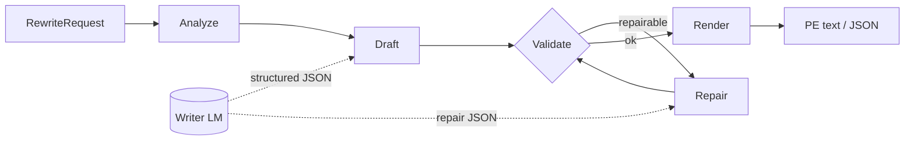

<div align="center">
  

  <p><strong>An open agentic prompt-expansion harness for image and video generation.</strong></p>
  <p>Turn everyday intent into validated, model-ready prompts through a bounded AI-agent workflow.</p>

  [](docs/architecture.md)
  [](https://github.com/WayneJin0918/Omni-Rewriter/actions/workflows/ci.yml)
  [](pyproject.toml)
  [](LICENSE)
  [](https://github.com/WayneJin0918/Omni-Rewriter/issues)
  [](docs/CONTRIBUTING.md)
</div>

---

<p align="center">
  <a href="docs/README_zh.md"><b>中文</b></a> ·
  <a href="docs/index.md"><b>Documentation</b></a> ·
  <a href="docs/getting-started.md"><b>Getting Started</b></a> ·
  <a href="docs/architecture.md"><b>Architecture</b></a> ·
  <a href="docs/generation-adapters.md"><b>Adapters</b></a> ·
  <a href="docs/ROADMAP.md"><b>Roadmap</b></a> ·
  <a href="docs/CONTRIBUTING.md"><b>Contributing</b></a>
</p>

## News

- **2026-08 — H3 workflow refresh:** updated the H3 video PE workflow with validated timeline,
  camera, dialogue, and bounded-repair rules, informed by the
  [public MiniMax-H3 project](https://github.com/MiniMax-AI/MiniMax-H3/tree/main).

## About

Omni-Rewriter is an open **Agent Harness for prompt expansion (PE)** — a control plane that turns
everyday image/video intent into typed, validated, generator-ready prompts.

Two ideas stay distinct:

| Term | Meaning in this repo |
| --- | --- |
| **Agent Harness** | The open-source product: schemas, orchestration, deterministic validation, bounded repair, dialect renderers, CLI/HTTP. It does **not** ship a fine-tuned writer checkpoint. |
| **PE (prompt expansion)** | The job the harness runs: rewrite short intent into a model-specific prompt dialect (H3 video, Seedream / Qwen-Image-Edit image, …). |

> [!IMPORTANT]
> **Expand ≠ generate.** `expand` stops at PE text/JSON. Image/video synthesis only runs when you
> explicitly call an adapter (or your own generator).

> [!NOTE]
> Dedicated SFT/RL writer checkpoints remain a community roadmap item. Today you plug in any
> writer that can return the required structured JSON.

> [!CAUTION]
> Built-in VLM pairwise scoring is **post-hoc** (judge frames after generation). It is not a
> VLM-guided PE optimization loop.

<table>
  <tr>
    <td width="33%" valign="top"><b>Agentic & bounded</b><br>Analyze → draft → validate → repair under strict schemas.</td>
    <td width="33%" valign="top"><b>Profile-extensible</b><br>Video/image dialects are plugins; the harness boundary is not MiniMax-only.</td>
    <td width="33%" valign="top"><b>Runtime-optional</b><br>PE works with closed APIs or open weights; generation adapters are opt-in.</td>
  </tr>
</table>

## How it works

The **Agent Harness** owns the loop. The **Writer LM** is called only where creativity is needed
(`Draft` / `Repair`). Validation and render stay deterministic. Output is PE text — not media.



| Step | Owner | What happens |
| --- | --- | --- |
| **Analyze** | Harness + Writer | Route video/image, read constraints/media, choose PE profile |
| **Draft** | **Writer LM** | Fill the profile schema as structured JSON |
| **Validate** | Harness | Deterministic checks (timeline, quotes, required fields, dialect rules) |
| **Repair** | **Writer LM** | Bounded retries on repairable failures; otherwise hard-fail |
| **Render** | Harness | Serialize to H3 / Seedream / Qwen-Image-Edit text |

Same path for CLI (`omni-rewriter expand`) and HTTP (`POST /v1/expand`). Details:
[architecture](docs/architecture.md).

## Writer LM agents

Any **OpenAI-compatible** chat endpoint that returns the required structured JSON can be the
Writer. The harness does not ship a fine-tuned PE checkpoint.

<p align="center">
  
  
  
</p>

<p align="center">
  
  
  
  
  
</p>

<p align="center">
  
  
  
</p>

<p align="center"><sub>
Point <code>OMNI_WRITER_BACKEND_*</code> at a closed API/gateway or an open model on vLLM/SGLang.
Generation adapters (Qwen-Image, Wan, HunyuanImage, …) are optional and never run inside
<code>expand</code> — see the <a href="docs/generation-adapters.md">compatibility matrix</a>.
</sub></p>

## Model ecosystem

PE / generator community board — left color = category (Video / Image / Unified); right =
`available` / `wanted`. Prefer small PRs with a title prefix — see
[CONTRIBUTING.md](docs/CONTRIBUTING.md).

<p align="center">
  
  
  
  
  
  
  
  
  
  
  
  
  
  
  
  
  
  
  
  
  
</p>

<p align="center">
  
  
  &nbsp;
  
  
  
</p>

<p align="center">
  <a href="https://github.com/WayneJin0918/Omni-Rewriter/compare?quick_pull=1&title=%5BModel%5D%5BVideo%5D%20"></a>
  &nbsp;
  <a href="https://github.com/WayneJin0918/Omni-Rewriter/compare?quick_pull=1&title=%5BModel%5D%5BImage%5D%20"></a>
  &nbsp;
  <a href="https://github.com/WayneJin0918/Omni-Rewriter/compare?quick_pull=1&title=%5BModel%5D%5BUnified%5D%20"></a>
</p>

<p align="center"><sub>Use the <a href=".cursor/skills/omni-rewriter-model-contribution/SKILL.md">model contribution skill</a>. Evidence-scoped details: <a href="docs/generation-adapters.md">compatibility matrix</a> · <a href="docs/community-models.md">full backlog</a>.</sub></p>

## Video RAW vs PE

<table cellspacing="0" cellpadding="0">
  <tr>
    <td width="50%" align="center"><br><sub>Concert crash-zoom · RAW</sub></td>
    <td width="50%" align="center"><br><sub>Concert crash-zoom · PE</sub></td>
  </tr>
  <tr>
    <td align="center"><br><sub>Kitchen whip-pan · RAW</sub></td>
    <td align="center"><br><sub>Kitchen whip-pan · PE</sub></td>
  </tr>
  <tr>
    <td align="center"><br><sub>Rooftop arc proposal · RAW</sub></td>
    <td align="center"><br><sub>Rooftop arc proposal · PE</sub></td>
  </tr>
</table>

<p align="center"><sub>Current video profile: MiniMax-H3. Homepage picks are complex camera/cut/dialogue PE-wins from the 15s stress set (s11–s16).</sub><br>
<a href="https://waynejin0918.github.io/Omni-Rewriter/"><b>H3 PE site →</b></a>
·
<a href="docs/day2-h3-pe/index.html">Local H3 PE page</a>
·
<a href="docs/h3-pe-showcase/index.html">Full 15-pair showcase</a>
·
<a href="docs/assets/gallery/index.html">Compact gallery</a></p>

## Quick start

```bash
python -m venv .venv
source .venv/bin/activate
python -m pip install -U pip
python -m pip install -e ".[cli,server]"
cp .env.example .env
set -a; source .env; set +a
```

Point `.env` at any OpenAI-compatible writer (closed API/gateway or open model on
**vLLM** / **SGLang**), then expand:

```bash
# OMNI_WRITER_BACKEND_BASE_URL + OMNI_WRITER_BACKEND_MODEL in .env

cat > request.json <<'JSON'
{
  "prompt": "A handmade kite catches an evening breeze above a grassy hill.",
  "duration_seconds": 6,
  "metadata": {"aspect_ratio": "16:9", "seed": "7"}
}
JSON

omni-rewriter expand request.json
omni-rewriter expand request.json --output h3
omni-rewriter validate output.json
```

Image tasks must explicitly set `task` and omit `duration_seconds`:

```json
{
  "prompt": "A rain-soaked neon sushi storefront, horizontal poster",
  "task": "t2i",
  "metadata": {"image_pe_profile": "seedream"}
}
```

For the shortest video, T2I, and image-edit paths, see
[Getting Started](docs/getting-started.md).

## Project layers

```text
RewriteRequest
  └─ Agent Harness       analyze · draft · validate · repair · render  (= PE flow)
      └─ PE profile      H3 / Seedream / Qwen-Image-Edit dialect
          └─ adapter     optional vLLM / SGLang / vendor client  (generate, not expand)
              └─ eval    structural checks · RAW/PE demos under docs/
```

- **Harness:** contracts + agent loop (this release).
- **Profiles:** public prompt dialects for video/image generators.
- **Adapters:** opt-in generation clients; never called by `service.expand`.
- **Evaluation:** structure-first checks; VLM pairwise is post-hoc only.

## Documentation

| Guide | English | 中文 |
| --- | --- | --- |
| Documentation index | [Open](docs/index.md) | [打开](docs/index_zh.md) |
| Getting started | [Open](docs/getting-started.md) | [打开](docs/getting-started_zh.md) |
| Architecture | [Open](docs/architecture.md) | [打开](docs/architecture_zh.md) |
| Video prompt expansion | [Open](docs/h3-pe-harness.md) | [打开](docs/h3-pe-harness_zh.md) |
| Image prompt expansion | [Open](docs/image-pe.md) | [打开](docs/image-pe_zh.md) |
| Generation adapters | [Open](docs/generation-adapters.md) | [打开](docs/generation-adapters_zh.md) |
| Evaluation | [Open](docs/evaluation.md) | [打开](docs/evaluation_zh.md) |

## Development

```bash
python -m pip install -e ".[dev]"
ruff check .
mypy src
pytest
python -m build
```

Contributions are welcome across core schemas, dialects, adapters, evaluation, documentation, and
future SFT/RL work. Start with [CONTRIBUTING.md](docs/CONTRIBUTING.md) and
[ROADMAP.md](docs/ROADMAP.md).

## Scope and license

Omni-Rewriter does not attempt to reproduce undisclosed closed-source behavior. It uses public
contracts and reproducible examples to help the community close the gap between polished demos,
public APIs, and deployable workflows. Untested runtime compatibility is labeled unverified.

Source code is licensed under [Apache License 2.0](LICENSE). Third-party models, services,
documentation, and names remain subject to their own terms. Security guidance is in
[SECURITY.md](docs/SECURITY.md).
