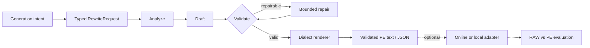

<div align="center">
  

  <p><strong>An open agentic prompt-expansion harness for image and video generation.</strong></p>
  <p>Turn everyday intent into validated, model-ready prompts through a bounded AI-agent workflow.</p>

  [](docs/architecture.md)
  [](https://github.com/WayneJin0918/Omni-Rewriter/actions/workflows/ci.yml)
  [](pyproject.toml)
  [](LICENSE)
  [](https://github.com/WayneJin0918/Omni-Rewriter/issues)
  [](CONTRIBUTING.md)
</div>

---

<p align="center">
  <a href="README_zh.md"><b>中文</b></a> ·
  <a href="docs/index.md"><b>Documentation</b></a> ·
  <a href="docs/getting-started.md"><b>Getting Started</b></a> ·
  <a href="docs/architecture.md"><b>Architecture</b></a> ·
  <a href="docs/generation-adapters.md"><b>Adapters</b></a> ·
  <a href="ROADMAP.md"><b>Roadmap</b></a> ·
  <a href="CONTRIBUTING.md"><b>Contributing</b></a>
</p>

## News

- **2026-08 — H3 workflow refresh:** updated the H3 video PE workflow with validated timeline,
  camera, dialogue, and bounded-repair rules, informed by the
  [public MiniMax-H3 project](https://github.com/MiniMax-AI/MiniMax-H3/tree/main).

## About

Omni-Rewriter is an open, model-extensible **agentic prompt expansion (PE) harness** for image and
video generation. Its AI-agent loop transforms natural multimodal intent into typed, validated,
generator-oriented text through bounded `analyze → draft → validate → repair`.

The framework is deliberately model-agnostic: task schemas, validation, rendering, runtime
adapters, and evaluation are separate extension layers.

> [!NOTE]
> **Current open-source release: Agent Harness.** It delivers agent orchestration, schemas,
> deterministic checks, and bounded repair today; dedicated SFT/RL writer checkpoints remain
> community roadmap items.

> [!IMPORTANT]
> **Expand is not generate.** The core harness produces validated text/JSON. Model loading and
> media generation happen only when an application explicitly invokes an adapter or local runner.

<table>
  <tr>
    <td width="33%" valign="top"><b>Agentic & bounded</b><br>Analyze, draft, validate, and repair with strict schemas and deterministic guardrails.</td>
    <td width="33%" valign="top"><b>Model-extensible</b><br>Profiles and renderers encode public prompt dialects without making them the architecture.</td>
    <td width="33%" valign="top"><b>Runtime-optional</b><br>Expansion remains independent from vendor APIs, online services, and heavyweight local inference.</td>
  </tr>
</table>

<details>
<summary><b>Writer / agent model compatibility</b> — frontier closed and open-weight backends</summary>

<br>

The PE orchestration is writer-model agnostic when the backend can return the required structured
JSON. It can use closed frontier agents such as **GPT-5.6** and **Claude Opus 5** through a
compatible endpoint, as well as open **Qwen / Qwen3 / Qwen3.5** models served locally.

| Writer family | Connection path | Repository evidence |
| --- | --- | --- |
| **GPT-5.6** | OpenAI-compatible chat-completions endpoint | Contract-compatible; provider access and live behavior are environment-specific |
| **Claude Opus 5** | OpenAI-compatible gateway | Gateway path supported; a native Anthropic client is not bundled |
| **Qwen series** | vLLM OpenAI-compatible server | Local launch scripts, structured output, and `enable_thinking` control |
| **Other writers** | Any compatible structured-output endpoint | Supported at the protocol boundary; live compatibility must be verified |

</details>

## How it works



The same service layer powers the CLI and HTTP API. See
[architecture](docs/architecture.md) for public schemas and lifecycle details.

<details>
<summary><b>Supported profiles and integrations</b> — click to expand the evidence-scoped matrix</summary>

<br>

| Modality | Family | Prompt expansion | Optional generation path | Status |
| --- | --- | --- | --- | --- |
| Video | **MiniMax-H3** | T2VA, I2VA, FL2VA, L2VA, Ref2VA | MiniMax API or H3-specific local contract | PE + adapters |
| Video | **LingBot Video** | Typed structured caption | Independent local runner and optional two-stage rewriter | Schema + runner |
| Video | **WAN** | Video PE mapped through public request fields | SGLang or vLLM-Omni-style video route | Adapter; live support version-dependent |
| Image | **Seedream-style frontier image profile** | T2I, I2I, image edit; prompt + ratio packing | Provider-specific runtime | PE |
| Image | **Qwen-Image / Edit** | Image and edit dialects | SGLang-compatible images API / local Diffusers | PE + adapter + T2I A/B |
| Image | **HunyuanImage-3.0** | Image blueprint through the image profile | Documented custom vLLM fork / local runner | Adapter + A/B |

Runtime support is evidence-scoped. A PE profile does not prove end-to-end runtime compatibility.
See the [compatibility matrix](docs/generation-adapters.md) for exact contracts and limitations.

</details>

## Community model tracks

<p align="center"><sub>Green is available at the documented evidence level. Gray is a scoped community opportunity.</sub></p>
<table>
  <tr>
    <th width="33%" align="left">VIDEO</th>
    <th width="33%" align="left">IMAGE</th>
    <th width="33%" align="left">UNIFIED</th>
  </tr>
  <tr>
    <td valign="top"><br><b>MiniMax-H3</b> · LingBot Video · WAN<br><br><sub>Timeline PE, structured captions, and version-scoped adapters.</sub><br><br><br><sub>Wan2.2 · HunyuanVideo · CogVideoX · LTX-Video · Mochi 1 · Step-Video</sub><br><br><a href="https://github.com/WayneJin0918/Omni-Rewriter/compare?quick_pull=1"><b>Open a Video PR →</b></a></td>
    <td valign="top"><br><b>Seedream-style</b> · Qwen-Image · HunyuanImage<br><br><sub>Typed prompt profiles, adapters, and reproducible fixtures where available.</sub><br><br><br><sub>FLUX.1 / Kontext · Stable Diffusion 3.5 · Kolors · PixArt-Sigma · Sana</sub><br><br><a href="https://github.com/WayneJin0918/Omni-Rewriter/compare?quick_pull=1"><b>Open an Image PR →</b></a></td>
    <td valign="top"><br><b>Show-o2 · Emu3 · Janus-Pro</b><br>BAGEL · OmniGen2<br><br><sub>Map understanding and generation explicitly; shared checkpoints do not imply every modality.</sub><br><br><a href="https://github.com/WayneJin0918/Omni-Rewriter/compare?quick_pull=1"><b>Open a Unified PR →</b></a></td>
  </tr>
</table>

<p align="center"><sub>Start with the <a href=".cursor/skills/omni-rewriter-model-contribution/SKILL.md">model contribution skill</a>; contracts and acceptance criteria are in the <a href="docs/community-models.md">full backlog</a>.</sub></p>

## H3 RAW vs PE

<table cellspacing="0" cellpadding="0">
  <tr>
    <th>Dialogue<br><sub>RAW</sub></th>
    <th>Dialogue<br><sub>PE</sub></th>
    <th>Product motion<br><sub>RAW</sub></th>
    <th>Product motion<br><sub>PE</sub></th>
    <th>Cinematic scene<br><sub>RAW</sub></th>
    <th>Cinematic scene<br><sub>PE</sub></th>
  </tr>
  <tr>
    <td></td>
    <td></td>
    <td></td>
    <td></td>
    <td></td>
    <td></td>
  </tr>
</table>

<p align="center"><a href="docs/assets/gallery/index.html"><b>Open the complete H3 video gallery →</b></a></p>

## Quick start

```bash
python -m venv .venv
source .venv/bin/activate
python -m pip install -U pip
python -m pip install -e ".[cli,server]"
cp .env.example .env
set -a; source .env; set +a
```

Start an OpenAI-compatible writer backend, then expand a request:

```bash
scripts/serve_qwen35_dev.sh

cat > request.json <<'JSON'
{
  "prompt": "A handmade kite catches an evening breeze above a grassy hill.",
  "duration_seconds": 6,
  "metadata": {"aspect_ratio": "16:9", "seed": "7"}
}
JSON

omni-rewriter expand request.json
omni-rewriter expand request.json --output h3
omni-rewriter validate output.json
```

Image tasks must explicitly set `task` and omit `duration_seconds`:

```json
{
  "prompt": "A rain-soaked neon sushi storefront, horizontal poster",
  "task": "t2i",
  "metadata": {"image_pe_profile": "seedream"}
}
```

For the shortest video, T2I, and image-edit paths, see
[Getting Started](docs/getting-started.md).

## Project layers

```text
RewriteRequest
  └─ PE harness          analyze · draft · validate · repair
      └─ dialect         task-specific prompt schema and renderer
          └─ adapter     optional HTTP client or local runner
              └─ eval    structural checks · RAW/PE experiments · galleries
```

- **Core:** typed request/output contracts and deterministic validation.
- **Profiles:** public model-specific prompt grammar and rendering.
- **Adapters:** opt-in runtime mappings; never called by `service.expand`.
- **Evaluation:** reproducible manifests and structure-first checks.
- **Future:** community SFT/RL, additional dialects, adapters, and judges.

## Documentation

| Guide | English | 中文 |
| --- | --- | --- |
| Documentation index | [Open](docs/index.md) | [打开](docs/index_zh.md) |
| Getting started | [Open](docs/getting-started.md) | [打开](docs/getting-started_zh.md) |
| Architecture | [Open](docs/architecture.md) | [打开](docs/architecture_zh.md) |
| H3 prompt expansion | [Open](docs/h3-pe-harness.md) | [打开](docs/h3-pe-harness_zh.md) |
| Image prompt expansion | [Open](docs/image-pe.md) | [打开](docs/image-pe_zh.md) |
| Generation adapters | [Open](docs/generation-adapters.md) | [打开](docs/generation-adapters_zh.md) |
| Evaluation | [Open](docs/evaluation.md) | [打开](docs/evaluation_zh.md) |

## Development

```bash
python -m pip install -e ".[dev]"
ruff check .
mypy src
pytest
python -m build
```

Contributions are welcome across core schemas, dialects, adapters, evaluation, documentation, and
future SFT/RL work. Start with [CONTRIBUTING.md](CONTRIBUTING.md) and
[ROADMAP.md](ROADMAP.md).

## Scope and license

Omni-Rewriter does not attempt to reproduce undisclosed closed-source behavior. It uses public
contracts and reproducible examples to help the community close the gap between polished demos,
public APIs, and deployable workflows. Untested runtime compatibility is labeled unverified.

Source code is licensed under [Apache License 2.0](LICENSE). Third-party models, services,
documentation, and names remain subject to their own terms. Security guidance is in
[SECURITY.md](SECURITY.md).
