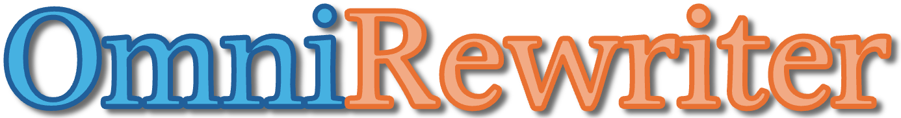
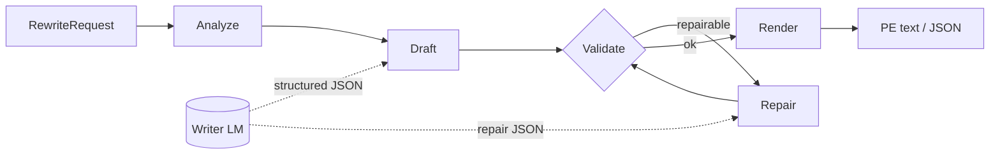
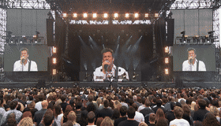
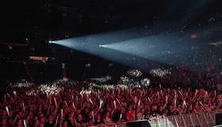
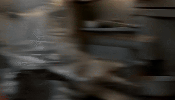
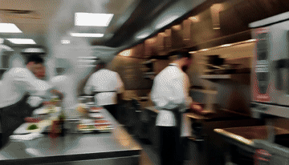
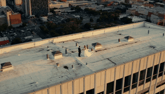

<div align="center">
  

  <p><strong>An open agentic prompt-expansion harness for image and video generation.</strong></p>
  <p>Turn everyday intent into validated, model-ready prompts through a bounded AI-agent workflow.</p>
  <p><sub>Harness (loop) → Writer (LLM) → PE profile (dialect) → Adapter (optional generate)</sub></p>

  [](docs/architecture.md)
  [](https://github.com/WayneJin0918/Omni-Rewriter/actions/workflows/ci.yml)
  [](pyproject.toml)
  [](https://github.com/WayneJin0918/Omni-Rewriter/blob/main/LICENSE)
  [](https://github.com/WayneJin0918/Omni-Rewriter/issues)
  [](docs/CONTRIBUTING.md)
</div>

---

<p align="center">
  <a href="docs/README_zh.md"><b>中文</b></a> ·
  <a href="docs/index.md"><b>Documentation</b></a> ·
  <a href="docs/getting-started.md"><b>Getting Started</b></a> ·
  <a href="docs/architecture.md"><b>Architecture</b></a> ·
  <a href="docs/dialects/generation-adapters.md"><b>Adapters</b></a> ·
  <a href="docs/ROADMAP.md"><b>Roadmap</b></a> ·
  <a href="docs/CONTRIBUTING.md"><b>Contributing</b></a>
</p>

## News

- **2026-08 — H3 workflow refresh:** updated the H3 video PE workflow with validated timeline,
  camera, dialogue, and bounded-repair rules, informed by the
  [public MiniMax-H3 project](https://github.com/MiniMax-AI/MiniMax-H3/tree/main).

## About

Open **Agent Harness** for image/video **prompt expansion (PE)**: schemas, orchestration,
validation, and dialect render — not a bundled PE checkpoint, not a media generator.

<sub>Expand ≠ generate. VLM pairwise scoring is post-hoc only. SFT/RL writers are roadmap.</sub>

## How it works

This is the method. The **Agent Harness** owns the loop; the **Writer LM** is called only for
`Draft` / `Repair`. Validation and render stay deterministic. Output is PE text/JSON — never media.



| Step | Owner | What happens |
| --- | --- | --- |
| **Analyze** | Harness + Writer | Route video/image, read constraints/media, choose PE profile |
| **Draft** | **Writer LM** | Fill the profile schema as structured JSON |
| **Validate** | Harness | Deterministic checks (timeline, quotes, required fields, dialect rules) |
| **Repair** | **Writer LM** | Bounded retries on repairable failures; otherwise hard-fail |
| **Render** | Harness | Emit PE text for terminal / execute models (T2I, T2V, …) |

Same path for CLI (`omni-rewriter expand`) and HTTP (`POST /v1/expand`). Details:
[architecture](docs/architecture.md).

## Writer LM agents

The harness talks to Writers over one contract: **OpenAI-compatible chat + structured JSON**.
It does not ship a fine-tuned PE checkpoint. How you host the Writer is separate from which
model family you pick.

**How the two Writer classes connect**

- **Core agents (closed frontier)** — GPT-5.6, Claude Opus 5, and similar. Connect via a vendor
  **API** or an OpenAI-compatible gateway (`OMNI_WRITER_BACKEND_BASE_URL` + model name).
- **Terminal / open weights** — QwenLM today; MiMo, Kimi, DeepSeek wanted. Serve locally (or on
  your cluster) with **vLLM** or **SGLang**, then point the same env vars at that OpenAI-compatible
  endpoint.

**Three access modes (same protocol)**

1. **API** — hosted frontier agents; no local GPU required for the Writer.
2. **vLLM** — common path for open-weight Writers (`/v1/chat/completions`, structured output).
3. **SGLang** — alternate OpenAI-compatible serve path for open Writers (also used by optional
   image/video generation adapters outside `expand`).

<p align="center">
  
  
  
</p>

<p align="center">
  
  
  
  
  
</p>

<p align="center"><sub>
Generation adapters stay outside <code>expand</code> — see the
<a href="docs/dialects/generation-adapters.md">compatibility matrix</a>.
</sub></p>

## Model ecosystem

Community board — left color = category (Video / Image / Unified); right = evidence depth
(`PE` / `adapter` / `unverified` / `wanted`). Prefer small PRs with a title prefix — see
[CONTRIBUTING.md](docs/CONTRIBUTING.md).

<p align="center">
  
  
  
  
  
  
  
  
  
  
  
  
  
  
  
  
  
  
  
  
  
  
</p>

<p align="center">
  
  
  
  
  &nbsp;
  
  
  
</p>

<p align="center">
  <a href="https://github.com/WayneJin0918/Omni-Rewriter/compare?quick_pull=1&title=%5BModel%5D%5BVideo%5D%20"></a>
  &nbsp;
  <a href="https://github.com/WayneJin0918/Omni-Rewriter/compare?quick_pull=1&title=%5BModel%5D%5BImage%5D%20"></a>
  &nbsp;
  <a href="https://github.com/WayneJin0918/Omni-Rewriter/compare?quick_pull=1&title=%5BModel%5D%5BUnified%5D%20"></a>
</p>

<p align="center"><sub>Use the <a href=".cursor/skills/omni-rewriter-model-contribution/SKILL.md">model contribution skill</a>. Evidence-scoped details: <a href="docs/dialects/generation-adapters.md">compatibility matrix</a> · <a href="docs/dialects/community-models.md">full backlog</a>.</sub></p>

## Video RAW vs PE

<table cellspacing="0" cellpadding="0">
  <tr>
    <td width="50%" align="center"><br><sub>Concert crash-zoom · RAW</sub></td>
    <td width="50%" align="center"><br><sub>Concert crash-zoom · PE</sub></td>
  </tr>
  <tr>
    <td align="center"><br><sub>Kitchen whip-pan · RAW</sub></td>
    <td align="center"><br><sub>Kitchen whip-pan · PE</sub></td>
  </tr>
  <tr>
    <td align="center"><br><sub>Rooftop arc proposal · RAW</sub></td>
    <td align="center"><br><sub>Rooftop arc proposal · PE</sub></td>
  </tr>
</table>

<p align="center"><sub>Current video profile: MiniMax-H3. Homepage picks: s15 concert crash-zoom, s14 kitchen whip-pan, s13 rooftop arc (from the published 15-pair set).</sub><br>
<a href="https://waynejin0918.github.io/Omni-Rewriter/"><b>H3 PE site →</b></a>
·
<a href="docs/day2-h3-pe/index.html">Local H3 PE entry (demo → home)</a>
·
<a href="docs/h3-pe-showcase/index.html">Full 15-pair showcase</a>
·
<a href="docs/assets/gallery/index.html">Compact gallery</a></p>

## Quick start

Gallery demos need no GPU. `expand` needs any OpenAI-compatible chat endpoint that returns
structured JSON (hosted API/gateway, or open weights on vLLM/SGLang).

```bash
python -m venv .venv
source .venv/bin/activate
python -m pip install -U pip
python -m pip install -e ".[cli,server]"
cp .env.example .env
```

Hosted Writer example (no local checkpoint):

```bash
export OMNI_WRITER_BACKEND_BASE_URL=https://api.openai.com/v1   # or any gateway
export OMNI_WRITER_BACKEND_MODEL=gpt-5.6
export OMNI_WRITER_BACKEND_API_KEY=sk-...

omni-rewriter expand examples/requests/t2va_kite.json
omni-rewriter expand examples/requests/t2va_kite.json --output h3
omni-rewriter expand examples/requests/t2i_neon.json
omni-rewriter validate output.json
```

Checked-in requests: [`examples/requests/`](examples/requests/). More paths:
[Getting Started](docs/getting-started.md).

## Project layers

```text
RewriteRequest
  └─ Agent Harness       analyze · draft · validate · repair · render  (= PE flow)
      └─ PE profile      H3 / Seedance / Seedream / Qwen-Image dialect
          └─ adapter     optional vLLM / SGLang / vendor client  (generate, not expand)
              └─ eval    structural checks · RAW/PE demos under docs/
```

- **Harness:** contracts + agent loop (this release).
- **Profiles:** public prompt dialects for video/image generators.
- **Adapters:** opt-in generation clients; never called by `service.expand`.
- **Evaluation:** structure-first checks; VLM pairwise is post-hoc only.

## Documentation

| Guide | English | 中文 |
| --- | --- | --- |
| Documentation index | [Open](docs/index.md) | [打开](docs/index_zh.md) |
| Getting started | [Open](docs/getting-started.md) | [打开](docs/getting-started_zh.md) |
| Architecture | [Open](docs/architecture.md) | [打开](docs/architecture_zh.md) |
| Video prompt expansion | [Open](docs/dialects/h3-pe-harness.md) | [打开](docs/dialects/h3-pe-harness_zh.md) |
| Image prompt expansion | [Open](docs/dialects/image-pe.md) | [打开](docs/dialects/image-pe_zh.md) |
| Generation adapters | [Open](docs/dialects/generation-adapters.md) | [打开](docs/dialects/generation-adapters_zh.md) |
| Evaluation | [Open](docs/evaluation.md) | [打开](docs/evaluation_zh.md) |

## Development

```bash
python -m pip install -e ".[dev]"
ruff check .
mypy src
pytest
python -m build
```

Contributions are welcome across core schemas, dialects, adapters, evaluation, documentation, and
future SFT/RL work. Start with [CONTRIBUTING.md](docs/CONTRIBUTING.md) and
[ROADMAP.md](docs/ROADMAP.md).

## Scope and license

Omni-Rewriter does not attempt to reproduce undisclosed closed-source behavior. It uses public
contracts and reproducible examples to help the community close the gap between polished demos,
public APIs, and deployable workflows. Untested runtime compatibility is labeled unverified.

Source code is licensed under [Apache License 2.0](https://github.com/WayneJin0918/Omni-Rewriter/blob/main/LICENSE). Third-party models, services,
documentation, and names remain subject to their own terms. Security guidance is in
[SECURITY.md](docs/SECURITY.md).
