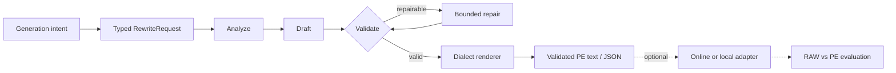

<div align="center">
  

  <p><strong>A typed, validated prompt-expansion framework for multimodal generation.</strong></p>
  <p>Turn everyday generation intent into model-ready video and image prompts—without coupling expansion to inference.</p>

  [](https://github.com/WayneJin0918/Omni-Rewriter/actions/workflows/ci.yml)
  [](pyproject.toml)
  [](LICENSE)
  [](https://github.com/WayneJin0918/Omni-Rewriter/issues)
  [](CONTRIBUTING.md)
</div>

---

<p align="center">
  <a href="README_zh.md"><b>中文</b></a> ·
  <a href="docs/index.md"><b>Documentation</b></a> ·
  <a href="docs/getting-started.md"><b>Getting Started</b></a> ·
  <a href="docs/architecture.md"><b>Architecture</b></a> ·
  <a href="docs/generation-adapters.md"><b>Adapters</b></a> ·
  <a href="ROADMAP.md"><b>Roadmap</b></a> ·
  <a href="CONTRIBUTING.md"><b>Contributing</b></a>
</p>

## News

- **2026-08 — MiniMax-H3:** added a validated H3 video PE profile and optional adapters. See the
  [official MiniMax-H3 repository](https://github.com/MiniMax-AI/MiniMax-H3/tree/main).

## About

Omni-Rewriter is an open, model-extensible **prompt expansion (PE)** framework for image and video
generation. It transforms natural multimodal intent into typed, validated, generator-oriented text
through a bounded `analyze → draft → validate → repair` loop.

The framework is deliberately model-agnostic: task schemas, validation, rendering, runtime
adapters, and evaluation are separate extension layers.

> [!IMPORTANT]
> **Expand is not generate.** The core harness produces validated text/JSON. Model loading and
> media generation happen only when an application explicitly invokes an adapter or local runner.

<table>
  <tr>
    <td width="33%" valign="top"><b>Typed & deterministic</b><br>Strict Pydantic contracts, task routing, structural validation, and bounded repair.</td>
    <td width="33%" valign="top"><b>Model-extensible</b><br>Profiles and renderers encode public prompt dialects without making them the architecture.</td>
    <td width="33%" valign="top"><b>Runtime-optional</b><br>Expansion remains independent from vendor APIs, online services, and heavyweight local inference.</td>
  </tr>
</table>

<details>
<summary><b>Writer / agent model compatibility</b> — frontier closed and open-weight backends</summary>

<br>

The PE orchestration is writer-model agnostic when the backend can return the required structured
JSON. It can use closed frontier agents such as **GPT-5.6** and **Claude Opus 5** through a
compatible endpoint, as well as open **Qwen / Qwen3 / Qwen3.5** models served locally.

| Writer family | Connection path | Repository evidence |
| --- | --- | --- |
| **GPT-5.6** | OpenAI-compatible chat-completions endpoint | Contract-compatible; provider access and live behavior are environment-specific |
| **Claude Opus 5** | OpenAI-compatible gateway | Gateway path supported; a native Anthropic client is not bundled |
| **Qwen series** | vLLM OpenAI-compatible server | Local launch scripts, structured output, and `enable_thinking` control |
| **Other writers** | Any compatible structured-output endpoint | Supported at the protocol boundary; live compatibility must be verified |

</details>

## How it works



The same service layer powers the CLI and HTTP API. See
[architecture](docs/architecture.md) for public schemas and lifecycle details.

<details>
<summary><b>Supported profiles and integrations</b> — click to expand the evidence-scoped matrix</summary>

<br>

| Family | Prompt expansion | Optional generation path | Status |
| --- | --- | --- | --- |
| **MiniMax H3** | T2VA, I2VA, FL2VA, L2VA, Ref2VA | MiniMax API or H3-specific local contract | PE + adapters |
| **Frontier closed-source image models** | T2I, I2I, image edit; prompt + ratio packing | Provider-specific runtime | PE |
| **Qwen-Image / Edit** | Image and edit dialects | SGLang-compatible images API / local Diffusers | PE + adapter + T2I A/B |
| **HunyuanImage-3.0** | Image blueprint through the image profile | Documented custom vLLM fork / local runner | Adapter + A/B |
| **WAN** | Video PE mapped through public request fields | SGLang or vLLM-Omni-style video route | Adapter; live support version-dependent |
| **LingBot Video** | Typed structured caption | Independent local runner and optional two-stage rewriter | Schema + runner |

Runtime support is evidence-scoped. A PE profile does not prove end-to-end runtime compatibility.
See the [compatibility matrix](docs/generation-adapters.md) for exact contracts and limitations.

</details>

## Community model backlog

Each item below is an explicit **contribution wanted**, not a support claim. Start with the
[model contribution skill](.cursor/skills/omni-rewriter-model-contribution/SKILL.md) and use the
[full scoped backlog](docs/community-models.md) for acceptance criteria and public upstream links.

### Video

`Wan2.2` · `HunyuanVideo` · `CogVideoX` · `LTX-Video` · `Mochi 1` · `Step-Video`

Contribute task routing, timeline/motion grammar, deterministic validation, renderers, fixtures,
and—only with public runtime evidence—an optional generation adapter.

### Image

`FLUX.1 / Kontext` · `Stable Diffusion 3.5` · `Kolors` · `PixArt-Sigma` · `Sana`

Contribute T2I/I2I/edit rules, reference-preservation semantics, ratio/resolution constraints,
multilingual fixtures, and model-specific rendering.

### Unified

`Show-o2` · `Emu3` · `Janus-Pro` · `BAGEL` · `OmniGen2`

Contribute explicit routing between understanding and generation modes. “Unified” does not imply
video support; every implemented task must be proven from the public model contract.

> [!TIP]
> A focused PR may add only the profile + validator + fixtures. Runtime adapters and live
> compatibility are separate follow-up contributions.

## RAW vs PE gallery

<p align="center"><b>Video prompt expansion</b></p>
<table>
  <tr>
    <th></th>
    <th>Dialogue</th>
    <th>Product motion</th>
    <th>Cinematic scene</th>
  </tr>
  <tr>
    <th>RAW</th>
    <td></td>
    <td></td>
    <td></td>
  </tr>
  <tr>
    <th>PE</th>
    <td></td>
    <td></td>
    <td></td>
  </tr>
</table>

<p align="center"><b>Image prompt expansion</b></p>
<table>
  <tr>
    <th></th>
    <th>Poster composition</th>
    <th>Architectural concept</th>
  </tr>
  <tr>
    <th>RAW</th>
    <td></td>
    <td></td>
  </tr>
  <tr>
    <th>PE</th>
    <td></td>
    <td></td>
  </tr>
</table>

<p align="center">
  <a href="docs/assets/gallery/index.html"><b>Open the complete video gallery</b></a> ·
  <a href="docs/assets/gallery/image/index.html"><b>Open the image gallery with prompts</b></a>
</p>

### Frontier closed-source image PE contract

<table>
  <tr>
    <td align="center" width="25%"><b>3</b><br><sub>T2I · I2I · Edit routes</sub></td>
    <td align="center" width="25%"><b>8 + reference</b><br><sub>validated ratio modes</sub></td>
    <td align="center" width="25%"><b>1 envelope</b><br><sub>prompt + ratio output</sub></td>
    <td align="center" width="25%"><b>bounded</b><br><sub>deterministic repair loop</sub></td>
  </tr>
</table>

Seedream is one public-facing example represented by this generic profile. These are schema-level
guarantees of the open PE contract, not claims about a private provider's internal implementation
or downstream image quality.

## Quick start

```bash
python -m venv .venv
source .venv/bin/activate
python -m pip install -U pip
python -m pip install -e ".[cli,server]"
cp .env.example .env
set -a; source .env; set +a
```

Start an OpenAI-compatible writer backend, then expand a request:

```bash
scripts/serve_qwen35_dev.sh

cat > request.json <<'JSON'
{
  "prompt": "A handmade kite catches an evening breeze above a grassy hill.",
  "duration_seconds": 6,
  "metadata": {"aspect_ratio": "16:9", "seed": "7"}
}
JSON

omni-rewriter expand request.json
omni-rewriter expand request.json --output h3
omni-rewriter validate output.json
```

Image tasks must explicitly set `task` and omit `duration_seconds`:

```json
{
  "prompt": "A rain-soaked neon sushi storefront, horizontal poster",
  "task": "t2i",
  "metadata": {"image_pe_profile": "seedream"}
}
```

For the shortest video, T2I, and image-edit paths, see
[Getting Started](docs/getting-started.md).

## Project layers

```text
RewriteRequest
  └─ PE harness          analyze · draft · validate · repair
      └─ dialect         task-specific prompt schema and renderer
          └─ adapter     optional HTTP client or local runner
              └─ eval    structural checks · RAW/PE experiments · galleries
```

- **Core:** typed request/output contracts and deterministic validation.
- **Profiles:** public model-specific prompt grammar and rendering.
- **Adapters:** opt-in runtime mappings; never called by `service.expand`.
- **Evaluation:** reproducible manifests and structure-first checks.
- **Future:** community SFT/RL, additional dialects, adapters, and judges.

## Documentation

| Guide | English | 中文 |
| --- | --- | --- |
| Documentation index | [Open](docs/index.md) | [打开](docs/index_zh.md) |
| Getting started | [Open](docs/getting-started.md) | [打开](docs/getting-started_zh.md) |
| Architecture | [Open](docs/architecture.md) | [打开](docs/architecture_zh.md) |
| H3 prompt expansion | [Open](docs/h3-pe-harness.md) | [打开](docs/h3-pe-harness_zh.md) |
| Image prompt expansion | [Open](docs/image-pe.md) | [打开](docs/image-pe_zh.md) |
| Generation adapters | [Open](docs/generation-adapters.md) | [打开](docs/generation-adapters_zh.md) |
| Evaluation | [Open](docs/evaluation.md) | [打开](docs/evaluation_zh.md) |

## Development

```bash
python -m pip install -e ".[dev]"
ruff check .
mypy src
pytest
python -m build
```

Contributions are welcome across core schemas, dialects, adapters, evaluation, documentation, and
future SFT/RL work. Start with [CONTRIBUTING.md](CONTRIBUTING.md) and
[ROADMAP.md](ROADMAP.md).

## Scope and license

Omni-Rewriter is an independent compatibility-oriented project. It does **not** claim to reproduce
private Context-IR or other undisclosed vendor behavior. Public contracts and examples—including
Seedream as one frontier closed-source image example—define the implemented profiles; untested
runtime compatibility is labeled unverified.

Source code is licensed under [Apache License 2.0](LICENSE). Third-party models, services,
documentation, and names remain subject to their own terms. Security guidance is in
[SECURITY.md](SECURITY.md).
