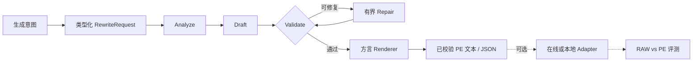
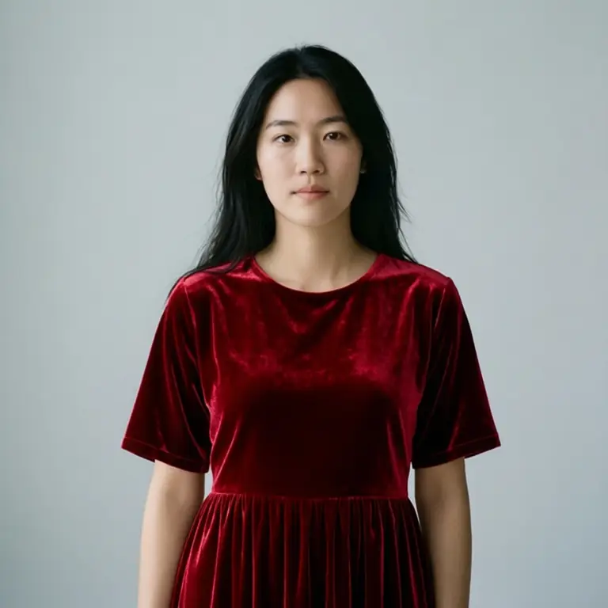
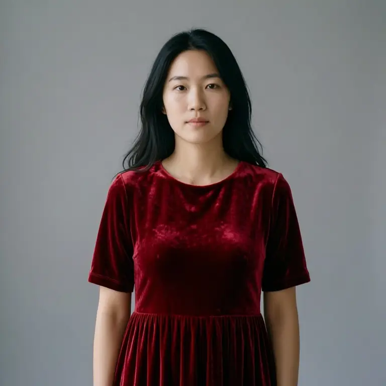

<div align="center">
  

  <p><strong>面向多模态生成的类型化、可校验 Prompt Expansion 框架。</strong></p>
  <p>将日常生成意图转换成模型可用的视频与图像提示词，同时保持 Expansion 与推理解耦。</p>

  [](https://github.com/WayneJin0918/Omni-Rewriter/actions/workflows/ci.yml)
  [](pyproject.toml)
  [](LICENSE)
  [](https://github.com/WayneJin0918/Omni-Rewriter/issues)
  [](CONTRIBUTING.md)
</div>

---

<p align="center">
  <a href="README.md"><b>English</b></a> ·
  <a href="docs/index_zh.md"><b>文档</b></a> ·
  <a href="docs/getting-started_zh.md"><b>快速开始</b></a> ·
  <a href="docs/architecture_zh.md"><b>架构</b></a> ·
  <a href="docs/generation-adapters_zh.md"><b>适配器</b></a> ·
  <a href="ROADMAP.md"><b>路线图</b></a> ·
  <a href="CONTRIBUTING.md"><b>参与贡献</b></a>
</p>

## 项目简介

Omni-Rewriter 是一个开放、可扩展模型的 **Prompt Expansion（PE）框架**。它通过有限次数的
`analyze → draft → validate → repair`，把自然的多模态生成意图转换为类型化、经过校验、
面向生成器的中间文本。

H3 视频、Seedream 风格图像、Qwen-Image-Edit、HunyuanImage、WAN 与 LingBot 都是 profile
或可选生成后端，不是框架能力的边界。

> [!IMPORTANT]
> **expand 不等于 generate。** 核心 harness 只输出经过校验的文本/JSON。只有应用显式调用
> adapter 或本地 runner 时，才会加载模型并生成媒体。

<table>
  <tr>
    <td width="33%" valign="top"><b>类型化且确定</b><br>严格 Pydantic 契约、任务路由、结构校验与有界修复。</td>
    <td width="33%" valign="top"><b>模型可扩展</b><br>profile 与 renderer 编码公开提示词方言，但不将其固化为架构边界。</td>
    <td width="33%" valign="top"><b>Runtime 可选</b><br>Expansion 与 SGLang、vLLM-Omni、厂商 API 和重型本地推理解耦。</td>
  </tr>
</table>

## 工作流程



CLI 与 HTTP API 共用相同 service 层。公共 schema 与完整生命周期见
[架构文档](docs/architecture_zh.md)。

## Profile 与集成状态

| 模型族 | Prompt Expansion | 可选生成路径 | 状态 |
| --- | --- | --- | --- |
| **MiniMax H3** | T2VA、I2VA、FL2VA、L2VA、Ref2VA | MiniMax API 或 H3 专用本地契约 | PE + adapters |
| **Seedream 风格图像** | T2I、I2I、图像编辑；prompt + ratio | 厂商 runtime | PE |
| **Qwen-Image / Edit** | 图像与编辑方言 | SGLang-compatible images API / 本地 Diffusers | PE + adapter + A/B |
| **HunyuanImage-3.0** | 通过图像 profile 生成视觉蓝图 | 文档化定制 vLLM fork / 本地 runner | Adapter + A/B |
| **WAN** | 通过公开请求字段映射视频 PE | SGLang 或 vLLM-Omni 风格视频接口 | Adapter；live 支持取决于版本 |
| **LingBot Video** | 类型化结构 caption | 独立本地 runner 与可选两阶段 rewriter | Schema + runner |

Runtime 支持严格按证据声明。支持某个 PE profile 不代表已经证明端到端生成兼容。
精确契约与限制见[兼容性矩阵](docs/generation-adapters_zh.md)。

## RAW vs PE 效果

<p align="center"><b>视频 · 对话与动作连续性</b></p>
<table>
  <tr>
    <th width="50%">RAW</th>
    <th width="50%">Omni-Rewriter PE</th>
  </tr>
  <tr>
    <td></td>
    <td></td>
  </tr>
</table>

<p align="center"><b>图像 · Qwen-Image-2512 文生图</b></p>
<table>
  <tr>
    <th width="50%">RAW</th>
    <th width="50%">Omni-Rewriter PE</th>
  </tr>
  <tr>
    <td></td>
    <td></td>
  </tr>
</table>

<p align="center">
  <a href="docs/assets/gallery/index.html"><b>打开完整视频 Gallery</b></a> ·
  <a href="docs/assets/gallery/image/index.html"><b>打开含提示词的图像 Gallery</b></a>
</p>

<details>
<summary><b>更多代表性对比</b></summary>

<br>

| 场景 | RAW | Omni-Rewriter PE |
| --- | --- | --- |
| 运动鞋广告 |  |  |
| 霓虹雨夜黑色电影 |  |  |
| 办公室到咖啡馆电话 |  |  |
| Qwen-Image-Edit-2511 |  |  |
| HunyuanImage-3.0 |  |  |

</details>

## 快速开始

```bash
python -m venv .venv
source .venv/bin/activate
python -m pip install -U pip
python -m pip install -e ".[cli,server]"
cp .env.example .env
set -a; source .env; set +a
```

启动 OpenAI-compatible writer，然后展开请求：

```bash
scripts/serve_qwen35_dev.sh

cat > request.json <<'JSON'
{
  "prompt": "一只手工风筝在傍晚微风中飞过草坡。",
  "duration_seconds": 6,
  "metadata": {"aspect_ratio": "16:9", "seed": "7"}
}
JSON

omni-rewriter expand request.json
omni-rewriter expand request.json --output h3
omni-rewriter validate output.json
```

图像任务必须显式指定 `task`，并省略 `duration_seconds`：

```json
{
  "prompt": "雨夜霓虹寿司店门口的横版海报",
  "task": "t2i",
  "metadata": {"image_pe_profile": "seedream"}
}
```

视频、T2I 与图像编辑的最短路径见[快速开始文档](docs/getting-started_zh.md)。

## 项目分层

```text
RewriteRequest
  └─ PE harness          analyze · draft · validate · repair
      └─ dialect         H3 · Seedream 风格 · Qwen Edit · LingBot caption
          └─ adapter     可选 HTTP client 或本地 runner
              └─ eval    结构检查 · RAW/PE 实验 · Gallery
```

- **Core：** 类型化输入输出契约与确定性校验。
- **Profiles：** 基于公开契约的模型提示词语法与渲染。
- **Adapters：** 可选 runtime 映射，绝不由 `service.expand` 自动调用。
- **Evaluation：** 可复现实验清单与结构优先评测。
- **Future：** 社区 SFT/RL、更多方言、adapter 与 judge。

## 文档导航

| 指南 | 中文 | English |
| --- | --- | --- |
| 文档索引 | [打开](docs/index_zh.md) | [Open](docs/index.md) |
| 快速开始 | [打开](docs/getting-started_zh.md) | [Open](docs/getting-started.md) |
| 架构 | [打开](docs/architecture_zh.md) | [Open](docs/architecture.md) |
| H3 Prompt Expansion | [打开](docs/h3-pe-harness_zh.md) | [Open](docs/h3-pe-harness.md) |
| 图像 Prompt Expansion | [打开](docs/image-pe_zh.md) | [Open](docs/image-pe.md) |
| 生成适配器 | [打开](docs/generation-adapters_zh.md) | [Open](docs/generation-adapters.md) |
| 评测 | [打开](docs/evaluation_zh.md) | [Open](docs/evaluation.md) |

## 开发与贡献

```bash
python -m pip install -e ".[dev]"
ruff check .
mypy src
pytest
python -m build
```

欢迎贡献核心 schema、方言、adapter、评测、文档与未来 SFT/RL 工作。请从
[CONTRIBUTING.md](CONTRIBUTING.md) 与 [ROADMAP.md](ROADMAP.md) 开始。

## 范围与许可

Omni-Rewriter 是独立的兼容性项目，不声称复刻 MiniMax 私有 Context-IR、Seedream 内部实现
或其他未公开厂商行为。已实现 profile 只依据公开契约与示例；未经测试的 runtime 兼容性会
明确标记为 unverified。

源码使用 [Apache License 2.0](LICENSE)。第三方模型、服务、文档与名称遵循各自条款。
安全说明见 [SECURITY.md](SECURITY.md)。
