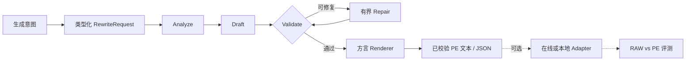

<div align="center">
  

  <p><strong>面向图像与视频生成的开源 Agentic Prompt Expansion Harness。</strong></p>
  <p>通过有界 AI Agent 工作流，将自然语言意图转换为经过校验、可直接交给生成器的提示词。</p>

  [](docs/architecture_zh.md)
  [](https://github.com/WayneJin0918/Omni-Rewriter/actions/workflows/ci.yml)
  [](pyproject.toml)
  [](LICENSE)
  [](https://github.com/WayneJin0918/Omni-Rewriter/issues)
  [](CONTRIBUTING.md)
</div>

---

<p align="center">
  <a href="README.md"><b>English</b></a> ·
  <a href="docs/index_zh.md"><b>文档</b></a> ·
  <a href="docs/getting-started_zh.md"><b>快速开始</b></a> ·
  <a href="docs/architecture_zh.md"><b>架构</b></a> ·
  <a href="docs/generation-adapters_zh.md"><b>适配器</b></a> ·
  <a href="ROADMAP.md"><b>路线图</b></a> ·
  <a href="CONTRIBUTING.md"><b>参与贡献</b></a>
</p>

## 最新动态

- **2026-08 — H3 工作流更新：**更新 H3 视频 PE 工作流中的时间轴、运镜、对白和有界修复
  规则，参考 [MiniMax-H3 公开项目](https://github.com/MiniMax-AI/MiniMax-H3/tree/main)。

## 项目简介

Omni-Rewriter 是一个开放、面向多模型扩展的**图像与视频 Agentic Prompt Expansion（PE）
Harness**。它通过有界 `analyze → draft → validate → repair` Agent 循环，把自然语言意图
与多模态参考转换为强类型、经过校验、面向生成器的中间文本。

框架本身不绑定具体模型：任务结构、校验规则、方言渲染、运行时适配器与评测都是彼此独立的
扩展层。

> [!NOTE]
> **当前开源版本：Agent Harness。** 现阶段提供 Agent 编排、强类型契约、确定性校验与有界
> 修复；专用 SFT/RL 扩写模型仍属于社区路线图。

> [!IMPORTANT]
> **扩写不等于生成。** 核心流程只输出经过校验的文本或 JSON。只有应用显式调用适配器或
> 本地运行器时，才会加载模型并生成媒体。

<table>
  <tr>
    <td width="33%" valign="top"><b>Agent 驱动、有界执行</b><br>在严格契约和确定性护栏下完成分析、起草、校验与修复。</td>
    <td width="33%" valign="top"><b>面向多模型扩展</b><br>配置档与渲染器描述公开提示词方言，但不将其固化为架构边界。</td>
    <td width="33%" valign="top"><b>与运行时解耦</b><br>提示词扩写不依赖厂商 API、在线服务或重型本地推理环境。</td>
  </tr>
</table>

<details>
<summary><b>扩写 Agent 模型兼容性</b> — 前沿闭源模型与开源权重模型</summary>

<br>

只要后端能够返回所需的结构化 JSON，PE 编排就不绑定具体扩写模型。它既可以通过兼容接口
使用 **GPT-5.6**、**Claude Opus 5** 等前沿闭源 Agent，也可以在本地运行开源的
**Qwen / Qwen3 / Qwen3.5** 系列。

| 扩写模型族 | 接入方式 | 仓库内依据 |
| --- | --- | --- |
| **GPT-5.6** | 兼容 OpenAI Chat Completions 的接口 | 协议契约兼容；访问权限与实际表现取决于部署环境 |
| **Claude Opus 5** | 兼容 OpenAI 协议的网关 | 支持网关路径；仓库暂未内置 Anthropic 原生客户端 |
| **Qwen 系列** | vLLM 提供的 OpenAI 兼容服务 | 本地启动脚本、结构化输出及 `enable_thinking` 控制 |
| **其他扩写模型** | 任意兼容结构化输出的接口 | 在协议边界上可接入；端到端兼容性需要实际验证 |

</details>

## 工作流程



CLI 与 HTTP API 共用相同 service 层。公共 schema 与完整生命周期见
[架构文档](docs/architecture_zh.md)。

## 模型生态

紧凑 shields：左 = 模型名 · 右 = `available`（绿）/ `wanted`（灰）· 最右色块 = 分类。
请优先提交带标题前缀的小 PR，详见 [CONTRIBUTING.md](CONTRIBUTING.md)。

<p align="center">
  
  
  
  
  
  
  
  
  
  
  
  
  
  
  
  
  
  
  
  
  
</p>

<p align="center">
  
  
  &nbsp;
  
  
  
</p>

<p align="center">
  <a href="https://github.com/WayneJin0918/Omni-Rewriter/compare?quick_pull=1&title=%5BModel%5D%5BVideo%5D%20"></a>
  &nbsp;
  <a href="https://github.com/WayneJin0918/Omni-Rewriter/compare?quick_pull=1&title=%5BModel%5D%5BImage%5D%20"></a>
  &nbsp;
  <a href="https://github.com/WayneJin0918/Omni-Rewriter/compare?quick_pull=1&title=%5BModel%5D%5BUnified%5D%20"></a>
</p>

<p align="center"><sub>请先使用<a href=".cursor/skills/omni-rewriter-model-contribution/SKILL.md">模型贡献 Skill</a>。证据范围详见<a href="docs/generation-adapters_zh.md">兼容性矩阵</a> · <a href="docs/community-models_zh.md">社区模型待办</a>。</sub></p>

## Video RAW vs PE

<table cellspacing="0" cellpadding="0">
  <tr>
    <td width="50%" align="center"><br><sub>演唱会急推多切 · RAW</sub></td>
    <td width="50%" align="center"><br><sub>演唱会急推多切 · PE</sub></td>
  </tr>
  <tr>
    <td align="center"><br><sub>厨房甩镜蒙太奇 · RAW</sub></td>
    <td align="center"><br><sub>厨房甩镜蒙太奇 · PE</sub></td>
  </tr>
  <tr>
    <td align="center"><br><sub>天台环绕求婚 · RAW</sub></td>
    <td align="center"><br><sub>天台环绕求婚 · PE</sub></td>
  </tr>
</table>

<p align="center"><sub>当前视频配置：MiniMax-H3。首页优先展示 15s 压力集（s11–s16）中运镜/剪辑/对白更复杂、PE 优势更明显的片段。</sub><br>
<a href="docs/h3-pe-showcase/index.html"><b>H3 PE showcase →</b></a>
·
<a href="docs/assets/gallery/index.html">精简 Gallery</a></p>

## 快速开始

```bash
python -m venv .venv
source .venv/bin/activate
python -m pip install -U pip
python -m pip install -e ".[cli,server]"
cp .env.example .env
set -a; source .env; set +a
```

启动兼容 OpenAI API 的提示词扩写模型服务，然后处理请求：

```bash
scripts/serve_qwen35_dev.sh

cat > request.json <<'JSON'
{
  "prompt": "一只手工风筝在傍晚微风中飞过草坡。",
  "duration_seconds": 6,
  "metadata": {"aspect_ratio": "16:9", "seed": "7"}
}
JSON

omni-rewriter expand request.json
omni-rewriter expand request.json --output h3
omni-rewriter validate output.json
```

图像任务必须显式指定 `task`，并省略 `duration_seconds`：

```json
{
  "prompt": "雨夜霓虹寿司店门口的横版海报",
  "task": "t2i",
  "metadata": {"image_pe_profile": "seedream"}
}
```

视频、T2I 与图像编辑的最短路径见[快速开始文档](docs/getting-started_zh.md)。

## 项目分层

```text
RewriteRequest
  └─ PE harness          analyze · draft · validate · repair
      └─ dialect         面向具体任务的提示词结构与渲染器
          └─ adapter     可选 HTTP client 或本地 runner
              └─ eval    结构检查 · RAW/PE 实验 · Gallery
```

- **核心层：** 强类型输入输出契约与确定性校验。
- **配置档：** 基于公开契约的模型提示词语法与渲染。
- **适配器：** 可选运行时映射，绝不由 `service.expand` 自动调用。
- **评测层：** 可复现实验清单与结构优先评测。
- **后续方向：** 社区 SFT/RL、更多方言、适配器与评测器。

## 文档导航

| 指南 | 中文 | English |
| --- | --- | --- |
| 文档索引 | [打开](docs/index_zh.md) | [Open](docs/index.md) |
| 快速开始 | [打开](docs/getting-started_zh.md) | [Open](docs/getting-started.md) |
| 架构 | [打开](docs/architecture_zh.md) | [Open](docs/architecture.md) |
| Video Prompt Expansion | [打开](docs/h3-pe-harness_zh.md) | [Open](docs/h3-pe-harness.md) |
| 图像 Prompt Expansion | [打开](docs/image-pe_zh.md) | [Open](docs/image-pe.md) |
| 生成适配器 | [打开](docs/generation-adapters_zh.md) | [Open](docs/generation-adapters.md) |
| 评测 | [打开](docs/evaluation_zh.md) | [Open](docs/evaluation.md) |

## 开发与贡献

```bash
python -m pip install -e ".[dev]"
ruff check .
mypy src
pytest
python -m build
```

欢迎贡献核心 schema、方言、adapter、评测、文档与未来 SFT/RL 工作。请从
[CONTRIBUTING.md](CONTRIBUTING.md) 与 [ROADMAP.md](ROADMAP.md) 开始。

## 范围与许可

Omni-Rewriter 并非为了复现闭源系统的未公开行为，而是依据公开契约和可复现实验，帮助社区
弥合产品演示、公开 API 与实际部署流程之间的差距。未经测试的运行时兼容性会明确标记为
“未验证”。

源码使用 [Apache License 2.0](LICENSE)。第三方模型、服务、文档与名称遵循各自条款。
安全说明见 [SECURITY.md](SECURITY.md)。
