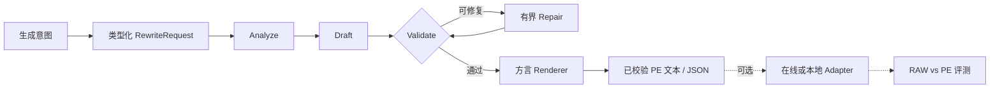
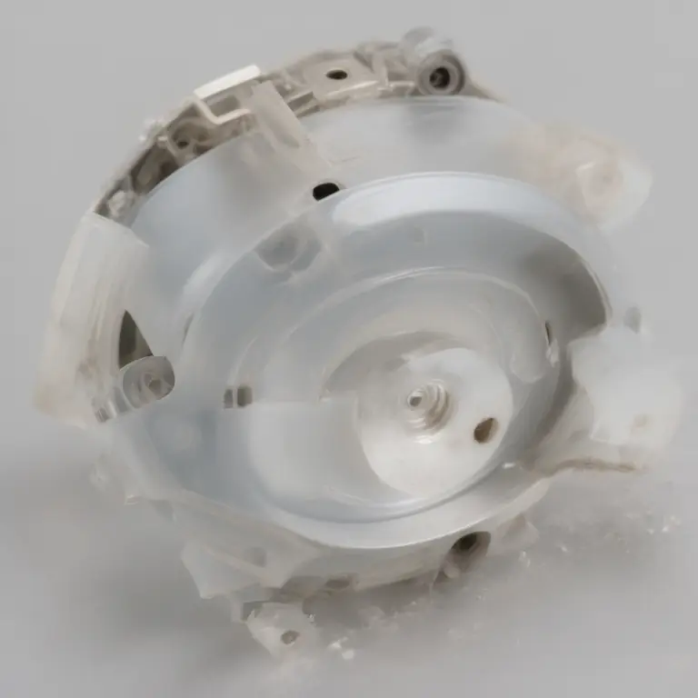
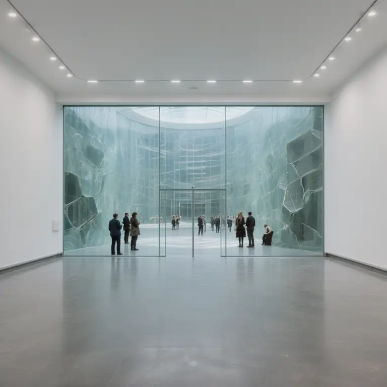

<div align="center">
  

  <p><strong>面向图像与视频生成的强类型、可校验提示词扩写框架。</strong></p>
  <p>将自然语言意图与多模态参考转换成生成器可用的提示词，同时保持扩写与推理解耦。</p>

  [](https://github.com/WayneJin0918/Omni-Rewriter/actions/workflows/ci.yml)
  [](pyproject.toml)
  [](LICENSE)
  [](https://github.com/WayneJin0918/Omni-Rewriter/issues)
  [](CONTRIBUTING.md)
</div>

---

<p align="center">
  <a href="README.md"><b>English</b></a> ·
  <a href="docs/index_zh.md"><b>文档</b></a> ·
  <a href="docs/getting-started_zh.md"><b>快速开始</b></a> ·
  <a href="docs/architecture_zh.md"><b>架构</b></a> ·
  <a href="docs/generation-adapters_zh.md"><b>适配器</b></a> ·
  <a href="ROADMAP.md"><b>路线图</b></a> ·
  <a href="CONTRIBUTING.md"><b>参与贡献</b></a>
</p>

## 项目简介

Omni-Rewriter 是一个开放、面向多模型扩展的**图像与视频提示词扩写（PE）框架**。它通过
有限次数的 `analyze → draft → validate → repair`，把自然语言意图与多模态参考转换为
强类型、经过校验、面向生成器的中间文本。

框架本身不绑定具体模型：任务结构、校验规则、方言渲染、运行时适配器与评测都是彼此独立的
扩展层。

> [!IMPORTANT]
> **扩写不等于生成。** 核心流程只输出经过校验的文本或 JSON。只有应用显式调用适配器或
> 本地运行器时，才会加载模型并生成媒体。

<table>
  <tr>
    <td width="33%" valign="top"><b>强类型、可校验</b><br>严格的数据契约、任务路由、结构校验与有限次修复。</td>
    <td width="33%" valign="top"><b>面向多模型扩展</b><br>配置档与渲染器描述公开提示词方言，但不将其固化为架构边界。</td>
    <td width="33%" valign="top"><b>与运行时解耦</b><br>提示词扩写不依赖厂商 API、在线服务或重型本地推理环境。</td>
  </tr>
</table>

## 工作流程



CLI 与 HTTP API 共用相同 service 层。公共 schema 与完整生命周期见
[架构文档](docs/architecture_zh.md)。

## 配置档与运行时集成

参考推理框架的“支持模型”列表，本节单独记录已经实现的具体集成，不把它们写进项目简介，
也不把它们当作架构边界。

| 模型族 | 提示词扩写 | 可选生成路径 | 状态 |
| --- | --- | --- | --- |
| **MiniMax H3** | T2VA、I2VA、FL2VA、L2VA、Ref2VA | MiniMax API 或 H3 专用本地契约 | 提示词扩写 + 适配器 |
| **Seedream 风格图像** | 文生图、图生图、图像编辑；提示词 + 比例封装 | 由服务商提供运行时 | 提示词扩写 |
| **Qwen-Image / Edit** | 图像生成与编辑方言 | 兼容 SGLang 的图像接口 / 本地 Diffusers | PE + 适配器 + 文生图 A/B |
| **HunyuanImage-3.0** | 通过通用图像配置生成视觉蓝图 | 已记录的定制 vLLM 分支 / 本地运行器 | 适配器 + A/B |
| **WAN** | 通过公开请求字段映射视频扩写结果 | SGLang 或 vLLM-Omni 风格视频接口 | 适配器；在线兼容性取决于版本 |
| **LingBot Video** | 强类型结构化描述 | 独立本地运行器与可选两阶段扩写器 | 数据结构 + 本地运行器 |

运行时支持只按公开证据和实际测试结果声明。具备某种提示词配置，并不表示已经证明端到端生成
兼容。精确契约与限制见[兼容性矩阵](docs/generation-adapters_zh.md)。

## RAW 与 PE 效果对比

<p align="center"><b>视频提示词扩写</b></p>
<table>
  <tr>
    <th></th>
    <th>人物对话</th>
    <th>产品运动</th>
    <th>电影化场景</th>
  </tr>
  <tr>
    <th>RAW</th>
    <td></td>
    <td></td>
    <td></td>
  </tr>
  <tr>
    <th>PE</th>
    <td></td>
    <td></td>
    <td></td>
  </tr>
</table>

<p align="center"><b>图像提示词扩写</b></p>
<table>
  <tr>
    <th></th>
    <th>海报构图</th>
    <th>建筑概念图</th>
  </tr>
  <tr>
    <th>RAW</th>
    <td></td>
    <td></td>
  </tr>
  <tr>
    <th>PE</th>
    <td></td>
    <td></td>
  </tr>
</table>

<p align="center">
  <a href="docs/assets/gallery/index.html"><b>打开完整视频 Gallery</b></a> ·
  <a href="docs/assets/gallery/image/index.html"><b>打开含提示词的图像 Gallery</b></a>
</p>

### Seedream 风格图像 PE 契约

<table>
  <tr>
    <td align="center" width="25%"><b>3 类任务</b><br><sub>文生图 · 图生图 · 图像编辑</sub></td>
    <td align="center" width="25%"><b>8 + 参考图</b><br><sub>经过校验的比例模式</sub></td>
    <td align="center" width="25%"><b>统一输出</b><br><sub>prompt + ratio</sub></td>
    <td align="center" width="25%"><b>有限次数</b><br><sub>确定性校验与修复</sub></td>
  </tr>
</table>

这些是开源 PE 配置档提供的结构保证，不代表掌握闭源服务的内部实现，也不是对下游生成质量
的承诺。

## 快速开始

```bash
python -m venv .venv
source .venv/bin/activate
python -m pip install -U pip
python -m pip install -e ".[cli,server]"
cp .env.example .env
set -a; source .env; set +a
```

启动兼容 OpenAI API 的提示词扩写模型服务，然后处理请求：

```bash
scripts/serve_qwen35_dev.sh

cat > request.json <<'JSON'
{
  "prompt": "一只手工风筝在傍晚微风中飞过草坡。",
  "duration_seconds": 6,
  "metadata": {"aspect_ratio": "16:9", "seed": "7"}
}
JSON

omni-rewriter expand request.json
omni-rewriter expand request.json --output h3
omni-rewriter validate output.json
```

图像任务必须显式指定 `task`，并省略 `duration_seconds`：

```json
{
  "prompt": "雨夜霓虹寿司店门口的横版海报",
  "task": "t2i",
  "metadata": {"image_pe_profile": "seedream"}
}
```

视频、T2I 与图像编辑的最短路径见[快速开始文档](docs/getting-started_zh.md)。

## 项目分层

```text
RewriteRequest
  └─ PE harness          analyze · draft · validate · repair
      └─ dialect         面向具体任务的提示词结构与渲染器
          └─ adapter     可选 HTTP client 或本地 runner
              └─ eval    结构检查 · RAW/PE 实验 · Gallery
```

- **核心层：** 强类型输入输出契约与确定性校验。
- **配置档：** 基于公开契约的模型提示词语法与渲染。
- **适配器：** 可选运行时映射，绝不由 `service.expand` 自动调用。
- **评测层：** 可复现实验清单与结构优先评测。
- **后续方向：** 社区 SFT/RL、更多方言、适配器与评测器。

## 文档导航

| 指南 | 中文 | English |
| --- | --- | --- |
| 文档索引 | [打开](docs/index_zh.md) | [Open](docs/index.md) |
| 快速开始 | [打开](docs/getting-started_zh.md) | [Open](docs/getting-started.md) |
| 架构 | [打开](docs/architecture_zh.md) | [Open](docs/architecture.md) |
| H3 Prompt Expansion | [打开](docs/h3-pe-harness_zh.md) | [Open](docs/h3-pe-harness.md) |
| 图像 Prompt Expansion | [打开](docs/image-pe_zh.md) | [Open](docs/image-pe.md) |
| 生成适配器 | [打开](docs/generation-adapters_zh.md) | [Open](docs/generation-adapters.md) |
| 评测 | [打开](docs/evaluation_zh.md) | [Open](docs/evaluation.md) |

## 开发与贡献

```bash
python -m pip install -e ".[dev]"
ruff check .
mypy src
pytest
python -m build
```

欢迎贡献核心 schema、方言、adapter、评测、文档与未来 SFT/RL 工作。请从
[CONTRIBUTING.md](CONTRIBUTING.md) 与 [ROADMAP.md](ROADMAP.md) 开始。

## 范围与许可

Omni-Rewriter 是独立的兼容性项目，不声称复刻 MiniMax 私有 Context-IR、Seedream 内部实现
或其他未公开厂商行为。已实现的提示词配置只依据公开契约与示例；未经测试的运行时兼容性会
明确标记为“未验证”。

源码使用 [Apache License 2.0](LICENSE)。第三方模型、服务、文档与名称遵循各自条款。
安全说明见 [SECURITY.md](SECURITY.md)。
