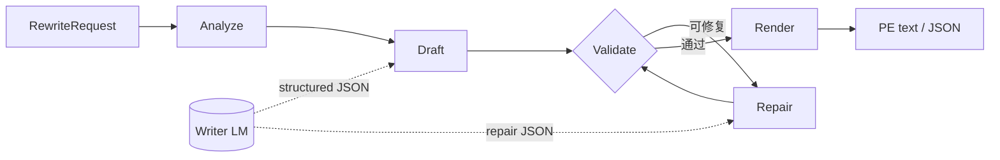
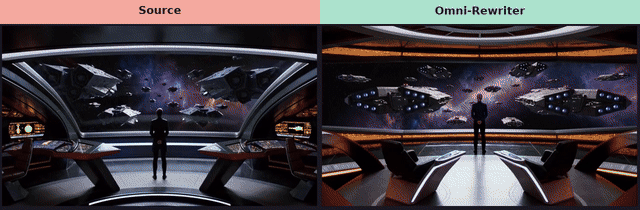
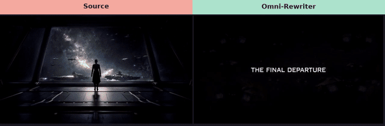
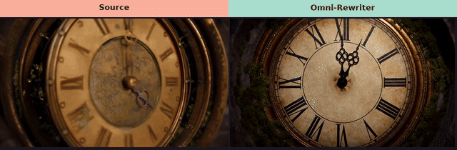
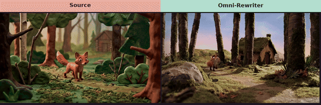

<div align="center">
  

  <p><strong>面向图像与视频生成的开源 Agentic Prompt Expansion Harness。</strong></p>
  <p>通过有界 AI Agent 工作流，将自然语言意图转换为经过校验、可直接交给生成器的提示词。</p>
  <p><sub>Harness（循环）→ Writer（LLM）→ PE profile（方言）→ Adapter（可选生成）</sub></p>

  [](architecture_zh.md)
  [](https://github.com/WayneJin0918/Omni-Rewriter/actions/workflows/ci.yml)
  [](https://github.com/WayneJin0918/Omni-Rewriter/actions/workflows/validate-pe.yml)
  [](https://pypi.org/project/omni-rewriter/)
  [](../pyproject.toml)
  [](https://github.com/WayneJin0918/Omni-Rewriter/blob/main/LICENSE)
  [](https://github.com/WayneJin0918/Omni-Rewriter/issues)
  [](https://github.com/WayneJin0918/Omni-Rewriter/discussions)
  [](CONTRIBUTING.md)
</div>

---

<p align="center">
  <a href="../README.md"><b>English</b></a> ·
  <a href="index_zh.md"><b>文档</b></a> ·
  <a href="getting-started_zh.md"><b>快速开始</b></a> ·
  <a href="architecture_zh.md"><b>架构</b></a> ·
  <a href="generation-adapters_zh.md"><b>适配器</b></a> ·
  <a href="ROADMAP.md"><b>路线图</b></a> ·
  <a href="CONTRIBUTING.md"><b>参与贡献</b></a>
</p>

## 最新动态

- **2026-08-14：** `omni-rewriter reconstruct` 把本地成片写成 H3 PE。推荐 Writer 为
  [Qwen3.6-35B-A3B](https://huggingface.co/Qwen/Qwen3.6-35B-A3B)。这是 Omni-Rewriter Replay。
- **2026-08 — 只校验安装：** `pip install omni-rewriter` 后即可
  `omni-rewriter validate`——不需要 GPU / Writer / generate。CI 可用
  `WayneJin0918/Omni-Rewriter@v0.1.0`。
- **2026-08 — Discussions + PE 校验 Action：** 已开启
  [Discussions](https://github.com/WayneJin0918/Omni-Rewriter/discussions)；根目录
  `action.yml` 可在任意仓库 CI 中校验 PE JSON（只校验，不 generate）。
- **2026-08 — H3 工作流更新：** 更新 H3 视频 PE 工作流中的时间轴、运镜、对白和有界修复规则，参考 [MiniMax-H3 公开项目](https://github.com/MiniMax-AI/MiniMax-H3/tree/main)。

## 项目简介

开放的图像/视频 **Prompt Expansion（PE）Agent Harness**：契约、编排、校验与方言渲染 ——
不附带专用 PE 权重，也不直接生成媒体。

<sub>扩写 ≠ 生成。VLM pairwise 仅事后诊断。SFT/RL Writer 在路线图。</sub>

## 工作原理

这是本仓库的方法。**Agent Harness** 拥有整条循环；**Writer LM** 只在 `Draft` / `Repair`
被调用。校验与渲染保持确定性。输出是 PE 文本/JSON，从不产生媒体。



| 步骤 | 负责方 | 做什么 |
| --- | --- | --- |
| **Analyze** | Harness + Writer | 区分视频/图像，读约束与媒体，选定 PE profile |
| **Draft** | **Writer LM** | 按 profile schema 产出结构化 JSON |
| **Validate** | Harness | 确定性校验（时间轴、引号、必填字段、方言规则） |
| **Repair** | **Writer LM** | 可修复错误做有限次重试；否则硬失败 |
| **Render** | Harness | 输出面向终端 / 执行模型的 PE 文本（T2I、T2V 等） |

CLI（`omni-rewriter expand`）与 HTTP（`POST /v1/expand`）共用同一路径。详见
[架构文档](architecture_zh.md)。

## Writer LM Agent

Harness 与 Writer 只约定一种协议：**OpenAI 兼容 Chat + 结构化 JSON**。不附带专用 PE 微调权重。
「用哪家模型」和「怎么部署接入」是两件事。

**两类 Writer 分别怎么接**

- **核心 Agent（闭源前沿）** — GPT-5.6、Claude Opus 5 等。走厂商 **API** 或 OpenAI 兼容网关
  （`OMNI_WRITER_BACKEND_BASE_URL` + model name）。
- **终端 / 开源权重** — 当前支持 QwenLM；MiMo、Kimi、DeepSeek 为 wanted。用 **vLLM** 或
  **SGLang** 在本地/集群拉起 OpenAI 兼容服务，再指向同一组环境变量。

**三种接入方式（协议相同）**

1. **API** — 托管前沿 Agent，Writer 侧无需本地 GPU。
2. **vLLM** — 开源 Writer 的常见部署路径（`/v1/chat/completions`、结构化输出）。
3. **SGLang** — 开源 Writer 的另一条 OpenAI 兼容部署路径（也可服务 `expand` 之外的可选
   图像/视频生成适配器）。

<p align="center">
  
  
  
</p>

<p align="center">
  
  
  
  
  
</p>

<p align="center"><sub>
生成适配器在 <code>expand</code> 之外 —— 见
<a href="generation-adapters_zh.md">兼容性矩阵</a>。
</sub></p>

## 模型生态

社区看板 — 左侧色 = 分类（Video / Image / Unified）；右侧 = 证据深度
（`PE` / `adapter` / `unverified` / `wanted`）。请优先提交带标题前缀的小 PR，详见
[CONTRIBUTING.md](CONTRIBUTING.md)。

<p align="center">
  
  
  
  
  
  
  
  
  
  
  
  
  
  
  
  
  
  
  
  
  
  
</p>

<p align="center">
  
  
  
  
  &nbsp;
  
  
  
</p>

<p align="center">
  <a href="https://github.com/WayneJin0918/Omni-Rewriter/compare?quick_pull=1&title=%5BModel%5D%5BVideo%5D%20"></a>
  &nbsp;
  <a href="https://github.com/WayneJin0918/Omni-Rewriter/compare?quick_pull=1&title=%5BModel%5D%5BImage%5D%20"></a>
  &nbsp;
  <a href="https://github.com/WayneJin0918/Omni-Rewriter/compare?quick_pull=1&title=%5BModel%5D%5BUnified%5D%20"></a>
</p>

<p align="center"><sub>请先使用<a href="../.cursor/skills/omni-rewriter-model-contribution/SKILL.md">模型贡献 Skill</a>。证据范围详见<a href="generation-adapters_zh.md">兼容性矩阵</a> · <a href="community-models_zh.md">社区模型待办</a>。</sub></p>

## Video RAW vs PE

<table cellspacing="0" cellpadding="0">
  <tr>
    <td width="50%" align="center"><br><sub>演唱会急推多切 · RAW</sub></td>
    <td width="50%" align="center"><br><sub>演唱会急推多切 · PE</sub></td>
  </tr>
  <tr>
    <td align="center"><br><sub>厨房甩镜蒙太奇 · RAW</sub></td>
    <td align="center"><br><sub>厨房甩镜蒙太奇 · PE</sub></td>
  </tr>
  <tr>
    <td align="center"><br><sub>天台环绕求婚 · RAW</sub></td>
    <td align="center"><br><sub>天台环绕求婚 · PE</sub></td>
  </tr>
</table>

<p align="center"><sub>当前视频配置：MiniMax-H3。首页三组：s15 演唱会急推、s14 厨房甩镜、s13 天台环绕（来自已发布 15 组）。</sub><br>
<a href="https://waynejin0918.github.io/Omni-Rewriter/"><b>H3 PE 站点 →</b></a>
·
<a href="day2-h3-pe/index.html">本地 H3 PE 进入页（短片 → 主站）</a>
·
<a href="h3-pe-showcase/index.html">完整 15 组 showcase</a>
·
<a href="assets/gallery/index.html">精简 Gallery</a>
·
<a href="assets/gallery/reconstruct/index.html">SOURCE vs REPLAY 复刻</a></p>

## Video SOURCE vs REPLAY

`omni-rewriter reconstruct` 观察本地成片得到校验后的 H3 `t2va` PE，再可选 MiniMax-H3 replay。
画面烧英文：**左 Source / 右 Omni-Rewriter**。各取前 10s 再对比。Expand ≠ generate。

<table cellspacing="0" cellpadding="0">
  <tr>
    <td align="center"><br><sub>10s 官方 T2VA · 左 Source · 右 Omni-Rewriter</sub></td>
  </tr>
  <tr>
    <td align="center"><br><sub>H3 cinematic · 前 10s · 左 Source · 右 Omni-Rewriter</sub></td>
  </tr>
  <tr>
    <td align="center"><br><sub>Seedance 宣传片 · 前 10s · 左 Source · 右 Omni-Rewriter</sub></td>
  </tr>
  <tr>
    <td align="center"><br><sub>H3 蒙太奇 · 前 10s · 左 Source · 右 Omni-Rewriter</sub></td>
  </tr>
</table>

<p align="center"><a href="assets/gallery/reconstruct/index.html"><b>SOURCE vs REPLAY gallery →</b></a></p>

## 试一下（不需要 GPU）

校验一份 PE envelope。这条路径不调用 Writer，也不生成媒体。

```bash
pip install omni-rewriter
# 或: uvx --from omni-rewriter omni-rewriter validate kite.json

curl -fsSL -o kite.json \
  https://raw.githubusercontent.com/WayneJin0918/Omni-Rewriter/v0.1.0/tests/fixtures/t2va_kite.json
omni-rewriter validate kite.json
```

在其他仓库的 GitHub Actions 里：

```yaml
- uses: actions/checkout@v4
- uses: WayneJin0918/Omni-Rewriter@v0.1.0
  with:
    files: prompts/**/*.json
```

下面的 expand 仍需要 OpenAI 兼容 Writer。扩写 ≠ 生成。

## 复刻成片

把本地短 mp4 读成可校验的 H3 `t2va` PE。成片留在磁盘。

```bash
omni-rewriter reconstruct clip.mp4 --pack-only --pack-dir /tmp/pe-pack
omni-rewriter reconstruct --from-observation docs/design/examples/observation_kite.json
omni-rewriter reconstruct clip.mp4
```

`--pack-only` 只要 ffmpeg。`--from-observation` 要文本 Writer。读片需要带视觉的 Writer。生成仍是另一步。

## 快速开始

Gallery 浏览不需要 GPU。推荐本地路径：**SGLang Qwen3.6-35B-A3B（语言+视觉 Writer）+ SGLang MiniMax-H3
（~30B FL2VA）**。托管 API Writer 作为备选。Expand ≠ generate——H3 仅用于可选成片。

```bash
python -m venv .venv
source .venv/bin/activate
python -m pip install -U pip
python -m pip install -e ".[cli,server]"
cp .env.example .env
```

### 1) 本地 SGLang（推荐）

终端 A — Qwen3.6-35B-A3B Writer（`:8000` OpenAI-compatible chat）：

```bash
export OMNI_WRITER_MODEL=Qwen/Qwen3.6-35B-A3B
export OMNI_WRITER_SERVED_MODEL_NAME=Qwen/Qwen3.6-35B-A3B
bash scripts/serve/serve_sglang_qwen_writer.sh
```

终端 B — MiniMax-H3 FL2VA（SGLang diffusion，`:30010`）：

```bash
export OMNI_WRITER_H3_MODEL=/path/to/MiniMax-H3/FL2VA
export OMNI_WRITER_H3_NUM_GPUS=8
bash scripts/serve/serve_sglang_h3.sh
```

```bash
export OMNI_WRITER_BACKEND_BASE_URL=http://127.0.0.1:8000/v1
export OMNI_WRITER_BACKEND_MODEL=Qwen/Qwen3.6-35B-A3B
export OMNI_WRITER_H3_BASE_URL=http://127.0.0.1:30010

omni-rewriter expand examples/requests/t2va_kite.json
omni-rewriter expand examples/requests/t2va_kite.json --output h3
omni-rewriter validate output.json
```

### 2) 托管 API Writer（备选）

```bash
export OMNI_WRITER_BACKEND_BASE_URL=https://api.openai.com/v1
export OMNI_WRITER_BACKEND_MODEL=gpt-5.6
export OMNI_WRITER_BACKEND_API_KEY=sk-...

omni-rewriter expand examples/requests/t2va_kite.json --output h3
```

示例请求见 [`examples/requests/`](../examples/requests/)。脚本见
[`scripts/serve/`](../scripts/serve/)。详见 [快速开始](getting-started_zh.md)、
[H3 adapters](dialects/h3-adapters.md)。

## 项目分层

```text
RewriteRequest
  └─ Agent Harness       analyze · draft · validate · repair · render  （= PE 流程）
      └─ PE profile      H3 / Seedance / Seedream / Qwen-Image 方言
          └─ adapter     可选 vLLM / SGLang / 厂商 client  （生成，不是 expand）
              └─ eval    结构检查 · docs/ 下的 RAW/PE 演示
```

- **Harness：** 契约与 Agent 循环（当前开源交付）。
- **Profiles：** 面向视频/图像生成器的公开提示词方言。
- **Adapters：** 可选生成客户端；绝不由 `service.expand` 自动调用。
- **评测：** 结构优先；VLM pairwise 仅事后诊断。

## 文档导航

| 指南 | 中文 | English |
| --- | --- | --- |
| 文档索引 | [打开](index_zh.md) | [Open](index.md) |
| 快速开始 | [打开](getting-started_zh.md) | [Open](getting-started.md) |
| 架构 | [打开](architecture_zh.md) | [Open](architecture.md) |
| Video Prompt Expansion | [打开](dialects/h3-pe-harness_zh.md) | [Open](dialects/h3-pe-harness.md) |
| 图像 Prompt Expansion | [打开](dialects/image-pe_zh.md) | [Open](dialects/image-pe.md) |
| 生成适配器 | [打开](dialects/generation-adapters_zh.md) | [Open](dialects/generation-adapters.md) |
| 评测 | [打开](evaluation_zh.md) | [Open](evaluation.md) |

## 开发与贡献

```bash
python -m pip install -e ".[dev]"
ruff check .
mypy src
pytest
python -m build
```

欢迎贡献核心 schema、方言、adapter、评测、文档与未来 SFT/RL 工作。请从
[CONTRIBUTING.md](CONTRIBUTING.md) 与 [ROADMAP.md](ROADMAP.md) 开始。

## 范围与许可

Omni-Rewriter 并非为了复现闭源系统的未公开行为，而是依据公开契约和可复现实验，帮助社区
弥合产品演示、公开 API 与实际部署流程之间的差距。未经测试的运行时兼容性会明确标记为
“未验证”。

源码使用 [Apache License 2.0](https://github.com/WayneJin0918/Omni-Rewriter/blob/main/LICENSE)。第三方模型、服务、文档与名称遵循各自条款。
安全说明见 [SECURITY.md](SECURITY.md)。
