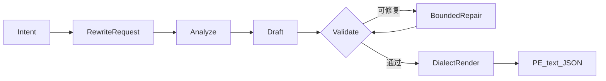

<div align="center">
  

  <p><strong>面向图像与视频生成的开源 Agentic Prompt Expansion Harness。</strong></p>
  <p>通过有界 AI Agent 工作流，将自然语言意图转换为经过校验、可直接交给生成器的提示词。</p>

  [](architecture_zh.md)
  [](https://github.com/WayneJin0918/Omni-Rewriter/actions/workflows/ci.yml)
  [](../pyproject.toml)
  [](../LICENSE)
  [](https://github.com/WayneJin0918/Omni-Rewriter/issues)
  [](CONTRIBUTING.md)
</div>

---

<p align="center">
  <a href="../README.md"><b>English</b></a> ·
  <a href="index_zh.md"><b>文档</b></a> ·
  <a href="getting-started_zh.md"><b>快速开始</b></a> ·
  <a href="architecture_zh.md"><b>架构</b></a> ·
  <a href="generation-adapters_zh.md"><b>适配器</b></a> ·
  <a href="ROADMAP.md"><b>路线图</b></a> ·
  <a href="CONTRIBUTING.md"><b>参与贡献</b></a>
</p>

## 最新动态

- **2026-08 — H3 工作流更新：**更新 H3 视频 PE 工作流中的时间轴、运镜、对白和有界修复
  规则，参考 [MiniMax-H3 公开项目](https://github.com/MiniMax-AI/MiniMax-H3/tree/main)。

## 项目简介

Omni-Rewriter 是一个开放的 **Prompt Expansion（PE）Agent Harness** —— 控制面：把日常的
图像/视频意图变成强类型、经过校验、可交给生成器的提示词。

两个概念要分开看：

| 术语 | 在本仓库中的含义 |
| --- | --- |
| **Agent Harness** | 开源产品本体：契约、编排、确定性校验、有界修复、方言渲染、CLI/HTTP。**不**附带专用微调扩写权重。 |
| **PE（提示词扩写）** | Harness 执行的任务：把短意图改写成面向具体生成器的提示词方言（H3 视频、Seedream / Qwen-Image-Edit 图像等）。 |

> [!IMPORTANT]
> **扩写 ≠ 生成。** `expand` 止于 PE 文本/JSON。只有显式调用适配器（或你自己的生成器）时
> 才会出图/出视频。

> [!NOTE]
> 专用 SFT/RL 扩写 checkpoint 仍在社区路线图。当前只需接入能返回所需结构化 JSON 的
> Writer。

> [!CAUTION]
> 内置 VLM pairwise 评分是**事后诊断**（生成后再评帧），不是 VLM 引导的 PE 优化闭环。

<table>
  <tr>
    <td width="33%" valign="top"><b>Agent 驱动、有界执行</b><br>在严格契约下完成 analyze → draft → validate → repair。</td>
    <td width="33%" valign="top"><b>Profile 可扩展</b><br>视频/图像方言是插件；架构边界不是「仅 MiniMax」。</td>
    <td width="33%" valign="top"><b>运行时可选</b><br>PE 可用闭源 API 或开源权重；生成适配器按需接入。</td>
  </tr>
</table>

## Agent Harness 与 PE 流程

**Harness** = 编排与契约。**PE 流程** = 每次 `expand` 内部的五步：



1. **Analyze** — 区分视频/图像，读取时长/媒体/元数据，选定 PE profile。
2. **Draft** — 调用 **Writer Agent**（LLM），按该 profile 的 schema 产出结构化字段。
3. **Validate** — 确定性校验（时间轴、引号、必填字段、方言规则）。
4. **Bounded repair** — 可修复错误则在有限次数内让 Writer 再修；否则明确失败。
5. **Dialect render** — 序列化为 H3 / Seedream / Qwen-Image-Edit 文本（仍不生成媒体）。

CLI（`omni-rewriter expand`）与 HTTP（`POST /v1/expand`）共用同一路径。详见
[架构文档](architecture_zh.md)。

## 当前支持

Writer 只需兼容 OpenAI 的 Chat 接口并能返回所需结构化 JSON。闭源与开源均可；开源栈常见于
**vLLM** / **SGLang**。

<p align="center">
  
  
  
  
</p>

<p align="center">
  
  
  
  
  
</p>

<p align="center">
  
  
  
</p>

<p align="center"><sub>
<strong>vLLM</strong> — 开源 Writer 主路径（<code>/v1/chat/completions</code>、结构化输出）；另有 HunyuanImage 自定义 fork 适配器与可选 Wan / vLLM-Omni（需钉版本并验证）。<br>
<strong>SGLang</strong> — Qwen-Image（SGLang-Diffusion <code>/v1/images/generations</code>）与可选 Wan 视频。<br>
stock vLLM ≠ 自定义 fork ≠ vLLM-Omni。可选生成适配器在 <code>expand</code> 之外 ——
见 <a href="generation-adapters_zh.md">兼容性矩阵</a>。
</sub></p>

## 模型生态

社区贡献看板 — 左侧色 = 分类（Video / Image / Unified）；右侧 = `available` /
`wanted`。请优先提交带标题前缀的小 PR，详见 [CONTRIBUTING.md](CONTRIBUTING.md)。

<p align="center">
  
  
  
  
  
  
  
  
  
  
  
  
  
  
  
  
  
  
  
  
  
</p>

<p align="center">
  
  
  &nbsp;
  
  
  
</p>

<p align="center">
  <a href="https://github.com/WayneJin0918/Omni-Rewriter/compare?quick_pull=1&title=%5BModel%5D%5BVideo%5D%20"></a>
  &nbsp;
  <a href="https://github.com/WayneJin0918/Omni-Rewriter/compare?quick_pull=1&title=%5BModel%5D%5BImage%5D%20"></a>
  &nbsp;
  <a href="https://github.com/WayneJin0918/Omni-Rewriter/compare?quick_pull=1&title=%5BModel%5D%5BUnified%5D%20"></a>
</p>

<p align="center"><sub>请先使用<a href="../.cursor/skills/omni-rewriter-model-contribution/SKILL.md">模型贡献 Skill</a>。证据范围详见<a href="generation-adapters_zh.md">兼容性矩阵</a> · <a href="community-models_zh.md">社区模型待办</a>。</sub></p>

## Video RAW vs PE

<table cellspacing="0" cellpadding="0">
  <tr>
    <td width="50%" align="center"><br><sub>演唱会急推多切 · RAW</sub></td>
    <td width="50%" align="center"><br><sub>演唱会急推多切 · PE</sub></td>
  </tr>
  <tr>
    <td align="center"><br><sub>厨房甩镜蒙太奇 · RAW</sub></td>
    <td align="center"><br><sub>厨房甩镜蒙太奇 · PE</sub></td>
  </tr>
  <tr>
    <td align="center"><br><sub>天台环绕求婚 · RAW</sub></td>
    <td align="center"><br><sub>天台环绕求婚 · PE</sub></td>
  </tr>
</table>

<p align="center"><sub>当前视频配置：MiniMax-H3。首页优先展示 15s 压力集（s11–s16）中运镜/剪辑/对白更复杂、PE 优势更明显的片段。</sub><br>
<a href="https://waynejin0918.github.io/Omni-Rewriter/"><b>H3 PE 站点 →</b></a>
·
<a href="day2-h3-pe/index.html">本地 H3 PE 页面</a>
·
<a href="h3-pe-showcase/index.html">完整 15 组 showcase</a>
·
<a href="assets/gallery/index.html">精简 Gallery</a></p>

## 快速开始

```bash
python -m venv .venv
source .venv/bin/activate
python -m pip install -U pip
python -m pip install -e ".[cli,server]"
cp .env.example .env
set -a; source .env; set +a
```

在 `.env` 中指向任意 OpenAI 兼容 Writer（闭源 API/网关，或部署在 **vLLM** /
**SGLang** 上的开源模型），然后扩写：

```bash
# .env 中配置 OMNI_WRITER_BACKEND_BASE_URL 与 OMNI_WRITER_BACKEND_MODEL

cat > request.json <<'JSON'
{
  "prompt": "一只手工风筝在傍晚微风中飞过草坡。",
  "duration_seconds": 6,
  "metadata": {"aspect_ratio": "16:9", "seed": "7"}
}
JSON

omni-rewriter expand request.json
omni-rewriter expand request.json --output h3
omni-rewriter validate output.json
```

图像任务必须显式指定 `task`，并省略 `duration_seconds`：

```json
{
  "prompt": "雨夜霓虹寿司店门口的横版海报",
  "task": "t2i",
  "metadata": {"image_pe_profile": "seedream"}
}
```

视频、T2I 与图像编辑的最短路径见[快速开始文档](getting-started_zh.md)。

## 项目分层

```text
RewriteRequest
  └─ Agent Harness       analyze · draft · validate · repair · render  （= PE 流程）
      └─ PE profile      H3 / Seedream / Qwen-Image-Edit 方言
          └─ adapter     可选 vLLM / SGLang / 厂商 client  （生成，不是 expand）
              └─ eval    结构检查 · docs/ 下的 RAW/PE 演示
```

- **Harness：** 契约与 Agent 循环（当前开源交付）。
- **Profiles：** 面向视频/图像生成器的公开提示词方言。
- **Adapters：** 可选生成客户端；绝不由 `service.expand` 自动调用。
- **评测：** 结构优先；VLM pairwise 仅事后诊断。

## 文档导航

| 指南 | 中文 | English |
| --- | --- | --- |
| 文档索引 | [打开](index_zh.md) | [Open](index.md) |
| 快速开始 | [打开](getting-started_zh.md) | [Open](getting-started.md) |
| 架构 | [打开](architecture_zh.md) | [Open](architecture.md) |
| Video Prompt Expansion | [打开](h3-pe-harness_zh.md) | [Open](h3-pe-harness.md) |
| 图像 Prompt Expansion | [打开](image-pe_zh.md) | [Open](image-pe.md) |
| 生成适配器 | [打开](generation-adapters_zh.md) | [Open](generation-adapters.md) |
| 评测 | [打开](evaluation_zh.md) | [Open](evaluation.md) |

## 开发与贡献

```bash
python -m pip install -e ".[dev]"
ruff check .
mypy src
pytest
python -m build
```

欢迎贡献核心 schema、方言、adapter、评测、文档与未来 SFT/RL 工作。请从
[CONTRIBUTING.md](CONTRIBUTING.md) 与 [ROADMAP.md](ROADMAP.md) 开始。

## 范围与许可

Omni-Rewriter 并非为了复现闭源系统的未公开行为，而是依据公开契约和可复现实验，帮助社区
弥合产品演示、公开 API 与实际部署流程之间的差距。未经测试的运行时兼容性会明确标记为
“未验证”。

源码使用 [Apache License 2.0](LICENSE)。第三方模型、服务、文档与名称遵循各自条款。
安全说明见 [SECURITY.md](SECURITY.md)。
