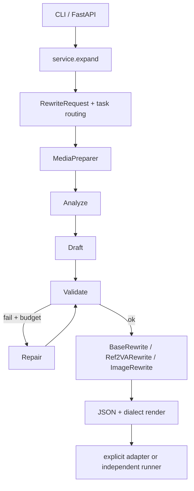

# Architecture

## Scope

Omni-Rewriter is an independent prompt-expansion framework. It converts a typed multimodal request
into validated, generator-oriented intermediate text. H3 and Seedance video PE, plus Seedream and
Qwen-Image image packing, are initial profiles built on shared contracts; future profiles
should reuse the same routing, validation, repair, and rendering boundaries. Video dialect
selection uses `metadata.video_pe_profile` (`h3` default, `seedance` optional).

The package separates rewriting from generation: `expand` produces text, while adapters submit
generation tasks only when an application explicitly calls them. The framework relies on public
contracts and reproducible evidence to bridge demos, APIs, and deployable workflows rather than
attempting to reproduce undisclosed closed-source behavior.

Flowcharts and skill notes live in [dialects/h3-pe-harness.md](dialects/h3-pe-harness.md).

## Components



```text
CLI / FastAPI
     |
service.expand
     |
RewriteRequest -> task routing -> MediaPreparer
                                  |
                                  v
OpenAI-compatible writer -> analyze -> draft -> validate <-> bounded repair
                                                   |
                    BaseRewrite / Ref2VARewrite / ImageRewrite
                                                   |
                                    JSON output / dialect renderer
                                                   |
                            optional H3Client / MiniMaxClient
```

- `models/` defines strict transport-neutral requests and validated output grammars.
- `media_input.py` loads local paths, HTTP(S), and data URIs, then emits Qwen/OpenAI-compatible
  multimodal content parts.
- `backends.py` is a small asynchronous OpenAI chat-completions client. It requests JSON Schema
  structured output and supports a Qwen `enable_thinking` chat-template switch.
- `agent.py` owns the analyze, draft, validate, repair, complete/failed state machine.
- `service.py` composes the default backend and media preparer for CLI/API use.
- `render.py` and model `render()` methods produce the target text.
- `adapters/` maps requests to generation-service payloads without coupling those services to the
  writer.
- `evaluator.py` provides deterministic conformance metrics.

## Writer / agent model boundary

The orchestration requires an OpenAI-compatible chat-completions endpoint with structured JSON
output. Closed frontier models such as GPT-5.6 and Claude Opus 5 can be connected through a
compatible provider endpoint or gateway; direct provider behavior remains deployment-specific.
Open Qwen-family models can be served through the included vLLM recipes, including the Qwen
`enable_thinking` switch. Protocol compatibility is not evidence of equal PE quality, context
limits, or live provider availability.

## Lifecycle

1. `RewriteRequest` rejects unknown fields, empty prompts, invalid media-role combinations,
   duplicate URIs, and explicit tasks that conflict with media.
2. Task routing chooses T2VA, I2VA, L2VA, FL2VA, or Ref2VA. Ref2VA can also be selected explicitly
   for any non-empty media set.
3. `MediaPreparer` reads each asset with size, MIME, scheme, timeout, redirect, and host controls.
4. The writer returns an `AnalysisPlan` containing intent, observable facts, timing/motion,
   audio/dialogue, continuity risks, and constraints.
5. A second structured-output call drafts `BaseRewrite` for T2VA/keyframe tasks or
   `Ref2VARewrite` for arbitrary references.
6. Local validators require matching task/duration, valid shots/timestamps and reference labels,
   and the appropriate H3 section grammar.
7. Invalid drafts enter a repair call containing only the invalid candidate, validation errors,
   and required task/duration. `OMNI_WRITER_MAX_REPAIRS` bounds this loop.
8. A successful result includes the typed output, analysis, repair count, random run ID, and
   rendered text. No generation request is submitted by this lifecycle.

The agent can write JSONL traces when instantiated with `RewriteAgentConfig(trace_path=...)`.
The default CLI/API service does not configure a trace path.

## VLM evaluation boundary

The experiment VLM scorer is a post-hoc diagnostic: it samples frames from already generated RAW
and PE videos, judges each pair, and writes aggregate scores. It is not called by `expand`, and its
scores do not select or revise prompt candidates. Consequently, structural validation and bounded
repair are part of the current PE lifecycle, while VLM-guided generation, ranking, and iterative
prompt revision remain future optimization work.

## Request and output contracts

`RewriteRequest` fields:

- `prompt`: 1–100,000 characters, no NUL.
- `duration_seconds`: positive decimal.
- `media`: up to 32 `MediaReference` objects.
- `task`: optional `t2va`, `i2va`, `fl2va`, `l2va`, or `ref2va`.
- `metadata`: string-to-string extension values.

Each media object has `media_type` (`image`, `video`, `audio`), `role`, URI, and optional name and
MIME. First/last-frame roles require images; audio roles require audio; source media cannot be
audio.

T2VA and keyframe outputs have `task`, `duration_seconds`,
`integrated_multimodal_description`, `overall_soundscape`, and `non_diegetic_music`. Ref2VA has
`duration_seconds`, `subject_definitions`, `summary`, `retention_analysis`,
`detailed_description`, `overall_soundscape`, and `non_diegetic_music`.

## Runtime configuration

All Python settings come from the process environment; no dotenv parser runs automatically.
See the root README and `.env.example` for the complete set.

The vLLM scripts additionally accept:

- `OMNI_WRITER_MODEL`: checkpoint path.
- `OMNI_WRITER_SERVED_MODEL_NAME`: API-visible model name.
- `OMNI_WRITER_VLLM_HOST` and `OMNI_WRITER_VLLM_PORT`.
- `OMNI_WRITER_MAX_MODEL_LEN`: maximum context length.
- `OMNI_WRITER_TENSOR_PARALLEL_SIZE`: tensor-parallel GPU count.
- `OMNI_WRITER_GPU_MEMORY_UTILIZATION`: per-worker memory fraction.

Development defaults target the local 9B checkpoint, 16K context, TP=1, and 0.90 memory
utilization. Production defaults target the local 122B-A10B checkpoint, 32K context, TP=8, and
0.92 utilization. These are operational starting points, not universal capacity guarantees.
Override them for checkpoint context limits, GPU count/memory, concurrency, and deployment
policy. Arguments appended to the script command line are passed directly to `vllm serve`.

The served model name and `OMNI_WRITER_BACKEND_MODEL` must match. The default Python backend model
is the production served name; when using the dev script, set
`OMNI_WRITER_BACKEND_MODEL=Qwen/Qwen3.5-9B`.

## Trust boundaries

Caller input, local files, remote media, writer responses, H3 responses, and MiniMax responses
cross separate trust boundaries.

`MediaPreparer` blocks non-global resolved addresses by default and rechecks every redirect.
`create_app` denies local filesystem media unless `OMNI_WRITER_ALLOW_LOCAL_MEDIA` is explicitly
true; CLI/library callers still default to allowing local paths for trusted developer workflows.
DNS validation cannot replace network egress controls. Bind the HTTP API to loopback unless you
intentionally expose it, and keep an application authorization layer in front of public hosts.

Adapter downloads (`bounded_download`) and cross-origin H3 content URLs reject non-public resolved
addresses; same-origin H3 downloads may still use loopback for a trusted local service. The FastAPI
app has no built-in authentication, authorization, rate limiting, moderation, or TLS.

## Public API surface

Treat these as the thin stable surface for SemVer `0.x` compatibility notes:

- Models: `RewriteRequest`, rewrite outputs (`BaseRewrite`, `Ref2VARewrite`, `ImageRewrite`,
  `SeedanceRewrite`), and `validate_output` / evaluator envelopes
- Orchestration: `omni_rewriter.service.expand`, `RewriteAgent`
- HTTP: `omni_rewriter.api.create_app`

Generation clients live under `omni_rewriter.adapters.*` and may change faster than expand contracts.
See `CHANGELOG.md` for release notes.

## Packaging

Hatchling builds the `src/omni_rewriter` package. Runtime prompts are Python modules, so no external
prompt template files are required. The wheel explicitly includes `py.typed` to advertise typed
package APIs. Documentation, tests, scripts, checkpoints, media, and traces are not runtime
package data.
