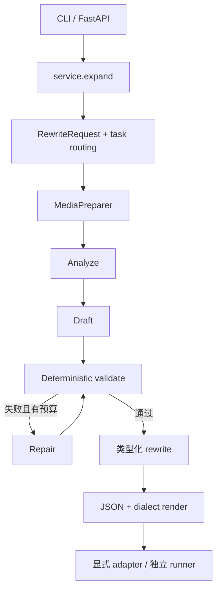

# 架构

[English](architecture.md) · [文档索引](index_zh.md)

## 范围与分层

Omni-Rewriter 是独立的 Prompt Expansion 框架：把类型化多模态请求转换成经过校验、面向
生成器的中间文本。H3 视频和 Seedream/Qwen-Image-Edit 风格图像打包是建立在公共契约上的
首批 profile；新 profile 应复用相同的路由、校验、修复和渲染边界。

`expand` 只产出文本。只有应用显式调用 adapter 或独立 runner，才会提交生成任务。项目不
声称了解、复刻或等同于任何厂商私有 Context-IR 架构。

## 组件

- `models/`：严格、与传输层无关的请求和输出语法。
- `media_input.py`：受大小、MIME、协议、超时、重定向和主机策略约束的媒体加载。
- `backends.py`：异步 OpenAI chat-completions writer 客户端与 JSON Schema 输出。
- `agent.py`：analyze、draft、validate、repair、complete/failed 状态机。
- `service.py`：为 CLI/API 组合 backend 和 media preparer。
- `render.py` 与 model `render()`：输出目标 PE 方言文本。
- `adapters/`：把请求映射到生成服务，不与 writer 生命周期耦合。
- `evaluator.py`：确定性格式一致性指标。

## 扩写 Agent 模型边界

编排层要求后端提供兼容 OpenAI Chat Completions 的接口和结构化 JSON 输出。GPT-5.6、
Claude Opus 5 等前沿闭源模型可通过兼容的服务商接口或网关接入，实际可用性与行为取决于部署
环境。开源 Qwen 系列可以通过仓库提供的 vLLM 配方运行，并支持 Qwen 的
`enable_thinking` 开关。协议兼容不代表不同模型具有相同的 PE 质量、上下文长度或在线可用性。

## 生命周期

1. `RewriteRequest` 拒绝未知字段、空 prompt、非法媒体 role、重复 URI 和冲突的显式任务。
2. 路由选择视频或图像任务及其 profile。
3. `MediaPreparer` 在资源限制和网络策略下读取媒体。
4. writer 返回包含意图、可观察事实、时序/动作、音频/对白、连续性风险与约束的分析。
5. 第二次结构化调用起草类型化 rewrite。
6. 本地 validator 检查任务、时长、镜头/时间戳、引用标签与目标方言语法。
7. 无效草稿连同错误和必要上下文进入有界修复；`OMNI_WRITER_MAX_REPAIRS` 限制次数。
8. 成功结果包含类型化输出、分析、修复次数、run ID 与渲染文本，不会自动提交生成任务。

## 请求与输出契约

`RewriteRequest` 包含 `prompt`、可选任务、最多 32 个媒体引用和字符串元数据。视频任务要求
正数 `duration_seconds`；图像任务必须省略。媒体可以是 image/video/audio，并带语义 role。

视频输出使用 `BaseRewrite` 或 `Ref2VARewrite`；图像输出使用 `ImageRewrite`。这些公开模型应
保持向后兼容。方言专属约束见 [H3 PE](h3-pe-harness_zh.md) 与
[图像 PE](image-pe_zh.md)。

## Runtime 配置

Python 设置来自进程环境，不自动解析 dotenv。仓库内 vLLM 脚本只服务 writer backend；
它们不表示相同 vLLM 安装能够生成任意图像或视频。模型生成 runtime 的证据与边界见
[生成适配器](generation-adapters_zh.md)。

## 信任边界

调用方输入、本地文件、远程媒体、writer 输出和生成服务响应分别跨越不同信任边界。默认
媒体加载拒绝非公网解析地址并检查每次重定向；但允许本地路径意味着默认 API 不适合直接提供
给任意不可信用户。生产部署需要身份认证、授权、最小文件权限、网络出口控制、限流和 TLS。

H3 下载 helper 信任已配置服务返回的 URL，只限制字节数，不提供完整 SSRF 沙箱。只连接可信
服务，并把生成文件与响应元数据视为不可信输入。
