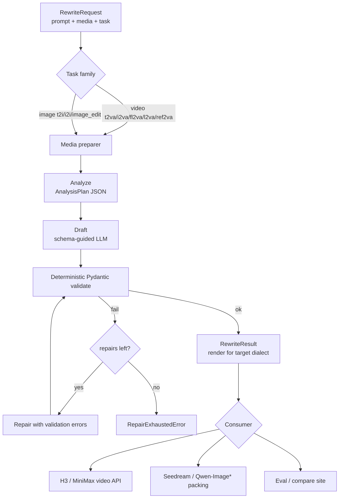
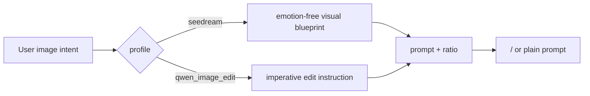

# H3 PE profile

[中文](h3-pe-harness_zh.md) · [Framework architecture](architecture.md)

## Why this exists

H3 is one video profile in the broader Omni-Rewriter prompt-expansion framework. It turns casual
video intent into typed H3-oriented text with deterministic grammar checks and bounded repair.
Profile support does not imply bundled generation or official vendor status; it gives the
community a reproducible bridge from public examples and APIs to validated prompts.

## Video PE layers (H3)

Inspired by the public H3 skill contracts archived under `docs/references/`:

1. Invariants
2. State
3. Transitions
4. Evidence
5. Observation plan (camera / edit)
6. Serialization (`BaseRewrite` or `Ref2VARewrite`)

## Image PE

## Related docs and skills

- `docs/index.md` — framework documentation
- `docs/architecture.md` — package layout
- `docs/image-pe.md` — image dialects
- `docs/h3-pe-harness.md` — this page
- `docs/references/jahnson-h3-skill-*.txt` — source skill dumps used to tighten rules
- `.cursor/skills/omni-rewriter-h3-pe/` — Cursor skill for contributors/agents
