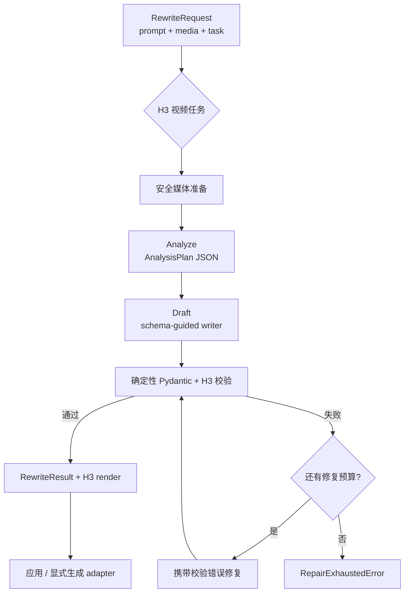

# H3 PE profile

[English](h3-pe-harness.md) · [框架架构](architecture_zh.md)

H3 是 Omni-Rewriter 通用 Prompt Expansion 框架中的一个视频 profile。它把口语化视频意图
转换成类型化 H3-oriented 文本，并执行确定性语法检查与有界修复。支持该 profile 不表示
自动生成视频或官方厂商身份；它为社区提供从公开示例和 API 到可复现提示词的桥梁。

## 任务路由

- `t2va`：无媒体的文生视频；
- `i2va`：一个 `first_frame` 图像；
- `l2va`：一个 `last_frame` 图像；
- `fl2va`：首帧和尾帧各一个；
- `ref2va`：任意非空引用集合，也可对非空媒体显式指定。

视频任务必须包含 `duration_seconds`。H3 adapter 进一步要求 4–15 秒整数。图像任务不使用
本 profile，并且必须省略时长。

## 六层视频 PE

规则依据仓库中 `docs/references/jahnson-h3-skill-*.txt` 的公开、脱敏 skill 归档收紧：

1. **Invariants**：身份、对象、场景、风格和必须保持的约束；
2. **State**：每个时刻可见/可听状态；
3. **Transitions**：动作、因果、持续性和可达的首尾帧路径；
4. **Evidence**：让约束在画面或声音中可验证的证据；
5. **Observation plan**：镜头、构图、剪辑和观察顺序；
6. **Serialization**：写入 `BaseRewrite` 或 `Ref2VARewrite`。

## 核心语法

- 首镜头使用 `[Shot 1]`；后续镜头使用 `[Shot N] At MM:SS.mmm,`。
- 对白写成 `<d>[Language] ...</d>`，speaker 放在标签外。
- 镜头运动使用自然英文描述类型，并可补充幅度/速度。
- FL2VA 必须精确尊重两个端点，优先描述连续、物理可达的路径。
- Ref2VA 先完成完整 Base 时间轴；引用只增加保留约束与来源，不替代场景描述。
- 输出的任务、时长、引用 label 和 section 必须与请求一致。

## Expand 与 generate

H3 renderer 产出生成器导向文本。`omni-rewriter expand` 不会提交视频任务。只有调用
`H3Client`、`MiniMaxClient` 或应用自有 adapter，才进入生成阶段。参见
[生成适配器](generation-adapters_zh.md) 与 [H3 adapter 英文文档](h3-adapters.md)。

## 参考

- [架构](architecture_zh.md)
- [图像 PE](image-pe_zh.md)
- `docs/references/jahnson-h3-skill-*.txt`
- `.cursor/skills/omni-rewriter-h3-pe/SKILL.md`
